```{r setup, include=FALSE}
library(tidyverse)
library(eurostat)
knitr::opts_chunk$set(echo = FALSE)
```

## Podstawowe pojęcia (1)

+ **Statystyka** -- Statystyka jest nauką traktującą o ilościowych metodach badania zjawisk (procesów) masowych. 
+ **Zjawiska masowe** -- kiedy badana jest wystarczająco duża liczba jednostek.
+ **Prawidłowości statystyczne** -- które można ujawnić w drodze obserwacji zjawisk masowych.
+ **Statystyka opisowa** -- dział statystyki zajmujący się metodami opisu danych statystycznych uzyskanych podczas badania statystycznego. Celem stosowania metod statystyki opisowej jest podsumowanie zbioru danych i wyciągnięcie pewnych podstawowych wniosków i uogólnień na temat zbioru.
+ **Statystyka matematyczna** -- dział statystyki, używający teorii prawdopodobieństwa i innych działów matematyki do rozwijania statystyki z czysto matematycznego punktu widzenia. Zajmuje się metodami wnioskowania statystycznego, które polegają na tym, że na podstawie wyników uzyskanych z próby formułujemy wnioski o całej zbiorowości. Wnioskowanie statystyczne obejmuje estymacje i weryfikację hipotez statystycznych.

## Podstawowe pojęcia (2)

Zbiorowość statystyczna (populacja) -- zbiór dowolnych elementów objętych badaniem statystycznym.

```{r, out.width = "1000px"}
knitr::include_graphics("https://writelatex.s3.amazonaws.com/gspkcsbcdfhp/uploads/141/10328292/13.png")
```

## Zbiorowość statystyczna -- przykłady

+ **Ludność** -- Ogół osób (ogółem lub według określonych cech) zameldowanych na pobyt stały w danej jednostce administracyjnej i rzeczywiście tam zamieszkałych oraz osób przebywających czasowo i zameldowanych w tej jednostce administracyjnej na pobyt czasowy ponad 3 miesiące (do 2005 r. ponad 2 miesiące).
+ **Populacja Polaków w wieku 15 i więcej** (Badanie Aktywności Ekonomicznej Ludności).
+ **Populacja gospodarstwach domowych**, w skład których wchodzą osoby w wieku 16-74 lata (Badanie Społeczeństwo Informacyjne). 
+ **Podmioty gospodarcze o liczbie pracujących 10 osób i więcej**, które prowadzą działalność gospodarczą zakwalifikowaną wg Polskiej Klasyfikacji Działalności (PKD) 2007: sekcja A, D, E, F, G, H, I, J, K, L, M, N, S (Badanie Społeczeństwo Informacyjne).

## Skale pomiarowe

+ **Skala nominalna** -- umowne symbole do klasyfikacji (np. płeć, województwo),
+ **Skala porządkowa** -- umowne symbole do klasyfikacji, które można uporządkować pod względem natężenia badanej cechy (np. oceny, skala Likerta),
+ **Skala przedziałowa** (interwałowa) -- zachowuje własności skali porządkowej i dodatkowo umożliwia obliczanie odległości między jednostkami (np. lata kalendarzowe, skale temperatur),
+ **Skala ilorazowa** -- ma własności powyższych kategorii i dodatkowo posiada naturalny punkt zerowy; możliwe są wszystkie działania matematyczne (np. wiek, dochody)

## Jednostka i cecha statystyczna

```{r, out.width = "1200px"}
knitr::include_graphics("https://writelatex.s3.amazonaws.com/gspkcsbcdfhp/uploads/141/10328292/1.png")
```


##  Jednostka statystyczna -- przykłady

+ **Gospodarstwo domowe** -- Zespół osób zamieszkujących razem i wspólnie utrzymujących się. Osoby samotne utrzymujące się samodzielnie tworzą jednoosobowe gospodarstwa domowe.
+ **Osoba prawna** -- Jednostka organizacyjna, której przepisy szczególne przyznają osobowość prawną.
+ **Lokal** -- Wydzielona trwałymi ścianami w obrębie budynku izba lub zespół izb przeznaczonych na stały pobyt ludzi, które wraz z pomieszczeniami pomocniczymi służą zaspokojeniu ich potrzeb mieszkaniowych lub wykorzystywane są zgodnie z przeznaczeniem na cele inne niż mieszkalne.
+ **Mieszkaniem** jest lokal składający się z jednej lub kilku izb, łącznie z pomieszczeniami pomocniczymi, wybudowany lub przebudowany do celów mieszkalnych, konstrukcyjnie wydzielony (trwałymi ścianami) w obrębie budynku, do którego to lokalu prowadzi niezależne wejście z klatki schodowej, ogólnego korytarza, wspólnej sieni bądź z ulicy, podwórza lub ogrodu.

Więcej na http://stat.gov.pl/metainformacje/slownik-pojec/pojecia-stosowane-w-statystyce-publicznej/lista.html


## Typologia badań statystycznych (1)

+ Kryterium podstawy formalno-prawnej:
    + badania objęte programem badań (art.18 ustawy o statystyce publicznej),
    + badania nieobjęte programem badań (art.21 ustawy o statystyce publicznej),
    + badania prowadzone na podstawie odrębnych ustaw, np. o spisach powszechnych (art. 9 ustawy o statystyce publicznej).
+ Kryterium organu prowadzącego -- prowadzone przez:
    + Prezesa GUS,
    + inny naczelny lub centralny organ administracji państwowej albo NBP,
    + Prezesa GUS wspólnie z innym naczelnym lub centralnym organem administracji państwowej, inną instytucją rządową lub NBP,
    + wskazany urząd statystyczny wspólnie z wojewodą albo organem jednostek samorządu terytorialnego na jego wniosek


## Typologia badań statystycznych (2)

+ Kryterium rodzaju źródła informacji:
    + **badania pierwotne** - oparte na danych statystycznych pozyskanych bezpośrednio od jednostek objętych badaniem,
    + **badania wtórne** - oparte na danych statystycznych uzyskanych w innych badaniach realizowanych w jednostkach służb statystyki publicznej lub z systemów informacyjnych administracji publicznej i rejestrów urzędowych oraz systemów pozaadministracyjnych.
+ Kryterium badanej zbiorowości:
    + **badania pełne** - obejmujące wszystkie jednostki populacji generalnej wyodrębnionej z punktu widzenia kryterium wyboru opisanego w programie badań,
    + **badania częściowe reprezentacyjne** -- gdzie obserwacji statystycznej poddaje się część populacji generalnej objętej badaniem tzw. próbę, wyodrębnioną w oparciu o metodę losowego wyboru jednostek, w którym każda jednostka losowania ma określone prawdopodobieństwo trafienia do próby,
    + **badania częściowe z doborem celowym jednostek** -- oparte o próbę z zastosowaniem celowego wyboru jednostek.
    

## Typologia badań statystycznych (3)

+ Kryterium obiektu/przedmiotu obserwacji:
    + przedsiębiorstwa,
    + osoby,
    + gospodarstwa domowe,
    + gospodarstwa rolne,
    + inne obiekty.
+ Kryterium ciągłości badania:
    + badania stałe -- zachowujące ciągłość w czasie,
    + badania cykliczne -- powtarzalne w ustalonych przedziałach czasu,
    + badania jednorazowe - przeprowadzane dla zaspokojenia doraźnych potrzeb zebrania danych o dziedzinie, zjawisku lub procesie.
+ Kryterium stopnia obligatoryjności badania:
    + badania obowiązkowe - przekazanie danych obowiązkowe
    + badania dobrowolne - przekazanie danych dobrowolne
    
    
## Przykłady źródeł danych

+ Statystyczne źródła danych:
    + spisy powszechne (por. NSP 2011),
    + badania reprezentacyjne,
    + rejestry statystyczne (np. REGON),
    + sprawozdawczość statystyczna (http://form.stat.gov.pl/)
+ Niestatystyczne:
    + rejestry adminstracyjne,
    + badania realizowane realizowane przez jednostki spoza statystyki publicznej (firmy badań marketingowych),
    + informacje zbierane przez przedsiębiorstwa (m.in. karty lojalnościowe, transakcje)
    + Big Data:
        + internetowe źródła danych (portale ogłoszeń, por. OLX),
        + Internet rzeczy,
        + portale społecznościowe,
        + sieci telekomunikacyjne,
        + banki, duże sieci handlowe
    
Najważniejsza różnica: **Źródła statystyczne tworzone są przez statystyków dla celów statystycznych, gdy źródła niestatystyczne służą innym celom i kto inny je tworzy**.

## Organizacja badania statystycznego

```{r, out.width = "1200px",fig.cap='Zintegrowany Model Realizacji Badań Statystycznych (ang. Generic Statistical Business Process Model)'}
knitr::include_graphics("https://writelatex.s3.amazonaws.com/gspkcsbcdfhp/uploads/141/10328292/14.png")
```

## Metody zbierania danych

Metoda wywiadu bezpośredni z udziałem lub bez udziału ankietera (@bethlehem2011handbook)

+ **PAPI** (Paper And Pen Personal Interview) -- wywiad bezpośredni z udziałem ankietera i papierową ankietą,

+ **CAI** (Computer-assisted interviewing) -- wywiad, w którym badanie wspierane jest przez komputer (nie ma papierowego kwestionariusza),

+ **CAPI** (Computer-assisted personal interviewing) -- wywiad bezpośredni z udziałem ankietera wspomagany komputerem (najczęściej laptopem), w celu podawania pytań i zapisu odpowiedzi.

+ **CSAQ** (Computer-assisted self-administered questionnaires) lub  CASI (Computer-assisted self-interviewing) -- wywiad, w którym respondent samodzielnie uzupełnia kwestionariusz na własnym komputerze.

+ **CATI** (Computer-assisted telephone interviewing) -- wywiad bezpośredni z udziałem ankietera wspomagany telefonicznie.

+ **CAWI** (Computer-assisted web interviewing) lub web survey -- wywiad, w którym respondent samodzielnie wypełnia kwestionariusz udostępniony w sieci Internet.

Propozycja aktualizacji powyższej pozycji o big data.

+ **BDASI** (Big Data-assisted self-interviewing) lub **IoTSI** (Internet of Things-assisted self-interviewing) -- metoda pasywnego zbierania danych, które dotyczą aktywności użytkownika. Może dotyczyć zarówno aktywności w sieci Internet, jak i urządzeń mobilnych (np. smartfon, smartwatch).


## Metody zbierania danych -- czy mają znaczenie?


+ W odniesieniu do braków odpowiedzi -- CATI mają zwykle większy odsetek odpowiedzi w porównaniu do CAWI,
+ W odniesieniu do braków odpowiedzi na poszczególne pytania -- CATI ma zwykle mniejszy odsetek odpowiedzi w ramach pytań niż badania CAWI,
+ Badania, w których brak jest kontroli ankietera (np. CAWI) charakteryzują się większym brakiem odpowiedzi, jak i błędami pomiaru (brak kontroli).
+ Odpowiedzi na pytania wrażliwe (np. dochody, orientację, seks) są zdecydowanie zależne od metody zbierania danych,
    + Socially desirable answer -- odpowiedź, która w ocenie respondenta jest bardziej akceptowalna społecznie.

## Metody zbierania danych -- z czego korzysta GUS?

+ Metoda PAPI – metoda zbierania informacji od respondentów w wywiadzie bezpośrednim prowadzonym przez ankietera z użyciem formularza papierowego.
+ Metoda CAPI – metoda zbierania informacji od respondentów w wywiadzie bezpośrednim prowadzonym przez ankietera z użyciem formularza elektronicznego przy wykorzystaniu terminali mobilnych lub tabletów.
+ Metoda CATI - metoda zbierania informacji od respondentów w wywiadzie telefonicznym wspomaganym komputerowo prowadzonym przez teleankietera z użyciem formularza elektronicznego.
+ Metoda CAWI/CAII - metoda zbierania informacji od respondentów poprzez samodzielne wypełnienie formularzy elektronicznych za pośrednictwem Internetu, w tym wykorzystanie portalu sprawozdawczego GUS

Szczegóły: http://form.stat.gov.pl/BadaniaAnkietowe/2017/harmonogram.htm


## Metody zbierania danych -- a może razem? 

+ Mixed mode (metoda mieszana) -- realizacja badania z wykorzystaniem wielu metod zbierania danych. Dlaczego?
    + rosnący odsetek braków odpowiedzi (m.in. braku kontaktu),
    + rosnący odsetek odmów odpowiedzi (m.in. obciążenie respodentów, brak zaufania do badań).

```{r, out.width = "500px",fig.cap='Konkurencyjne wykorzystanie różnych metod zbierania danych. Źródło: @bethlehem2011handbook, p. 239'}
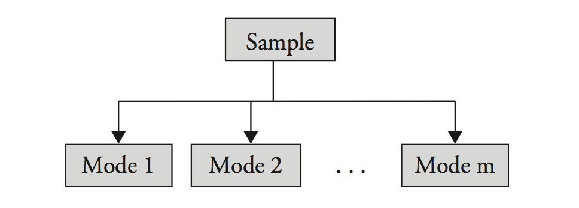
```

```{r, out.width = "500px",fig.cap='Sekwencyjne wykorzystanie różnych metod zbierania danych. Źródło: @bethlehem2011handbook, p. 239'}
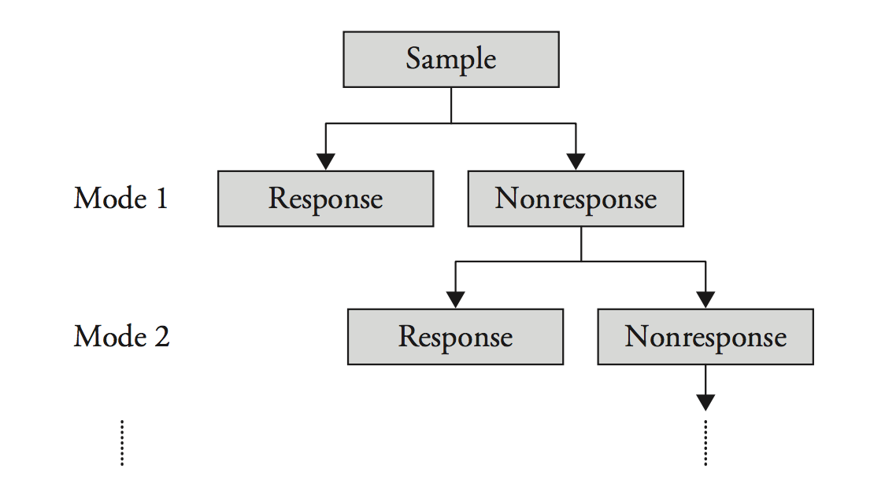
```

## Metody zbierania danych -- Przykłady

+ Badanie Budżetów Kapitału Ludzkiego
    + CAWI/CAII
    + PAPI
+ Badanie Aktywności Ekonomicznej Ludności:
    + PAPI/CAPI/CATI
+ Badanie Kapitału Ludzkiego (2010 do 2014)
    + CAPI -- 84, 77, 92.5, 90.7
    + PAPI -- 16, 23, 7.5, 9.3
+ NSP 2011 (metodyka -- [LINK](http://stat.gov.pl/cps/rde/xbcr/gus/LUD_ludnosc_stan_str_dem_spo_NSP2011.pdf))
    + Źródła administracyjne -– rejestry i systemy informacyjne Państwa
    + Badanie reprezentacyjne --  próba losowa ok. 20% mieszkań w skali kraju (2 744 tys. mieszkań)
    + Badanie pełne **przeprowadzone drogą internetową** -- każda osoba mogła dokonać spisu bezpośrednio na specjalnie dla niej przygotowanym formularzu, tj. poprzez weryfikację danych pozyskanych z rejestrów administracyjnych i systemów informacyjnych. Formularz krótki (16 pytań) -- 10% ludności
    
## Metody zbierania danych -- a może razem? 

+ Nie ma jednego sposobu jak przeprowadzać badanie metodą mieszaną,
+ Każdy sposób badania ma charakterystyczne dla siebie problemy,
+ Wybór metody zależy od tego, na minimalizacji, którego błędu nam zależy (o tym więcej później),

## Zbieranie danych przez Internet, dlaczego? [@bethlehem2011handbook]

Zalety:
  + krótki czas kontaktu z respodentem,
  + przypominanie o badaniu (follow-ups) jest prostsze i szybsze,
  + czas między wypełnieniem, a otrzymaniem danych jest bardzo krótki,
  + dane są gotowe do dalszej analizy,
  + respondenci mogą uzuepłnic część ankiety, a później kontynuować badanie,
  + kwestionariusz może już być częsciowo uzupełniony (por. NSP 2011),
  + respondenci mogą kontaktować się w sprawie problemów z kwestionariuszem (automatyzacja kontaktu),
  + możliwość kontroli wielokrotnego uzupełnania kwestionariusza,
  + automatyzacja przejść,
  + bieżące monitorowanie,
  + możliwe mniejsze obciążenie związane z wrażliwymi pytaniami.

Wady:
  + dobór próby 
  + nie wpływają na zwiększenie odsetka wypełnionych ankiet, wręcz przeciwnie.
  + brak kontroli ankietera (błędy pomiaru),
  + straight-lining

## Badania częściowe -- przykłady (1)

@bethlehem2011handbook wymieniają następujące badania oparte na próbie

+ **Cross-sectional survey** (badanie przekrojowe) -- A survey that observes a sample from the target population at one point in time. The objective is to describe the state of the population at that moment in time.
+ **Longitudinal (panel) survey** (badanie longitudinalne) -- A survey that observes the same sample from the target population at several points in time. The objective is to describe the changes of the population over time.
+ **E-mail survey** -- A form of data collection via the Internet in which respondents are sent a questionnaire that is part of the body text of an e-mail. The question- naire is completed by returning the e-mail after answering the questions in the text.
+ **Mail survey** -- A form of data collection where paper questionnaire forms are sent to the respondents. After completion of the questionnaires, they are returned to the research organization.


## Badania częściowe -- przykłady (2)

@bethlehem2011handbook wymieniają następujące badania oparte na próbie

+ **Web survey** -- A form of data collection via the Internet in which respondents complete the questionnaires on the World Wide Web. The questionnaire is accessed by means of a link to a web page.
+ **Internet survey** -- A general term for various forms of data collection via the Internet. Examples are a web survey and an e-mail survey. Included also are forms of data collection that use the Internet just to transport the questionnaire and the collected data.
+ **Self-selection survey** - A survey for which the sample has been recruited by means of self-selection. It is left to the persons themselves to decide to participate in a survey.
+ **Self-selection panel** - A web panel for which people select themselves in response to a banner, pop-up window, or advertisement in other media (radio, TV, and newspapers); Also Opt-in panel, Volunteer panel, Access panel.

## Badania częściowe -- przykłady (3)

@bethlehem2011handbook wymieniają następujące badania oparte na próbie

+ **Web panel** -- A survey in which the same individuals are interviewed via the web at different points in time.
+ **Mixed-mode survey** -- A survey in which various modes of data collection are combined. Modes can be used concurrently (different groups are approached by different modes) or sequentially (nonrespondents of a mode are reapproached in a different mode).
+ **Reference survey** -- A survey conducted with the objective to obtain unbiased estimates of the population distributions of auxiliary variables.

## Badania częściowe -- panele (1)

@callegaro2014online wymienia przykłady badań panelowych prowadzonych przez Internet

+ **General population panel** (panele dot. populacji generalnej) -- are the most common. These panels tend to be very large and are recruited to include the diversity of the general population, sometimes including people in hard-to-reach subpopulations. A general population panel typically is used as a frame, from which samples are drawn based on the requirements of individual studies. 
+ **Specialty panel** (panele specjalne) -- are designed to permit study of subpopulations de ned by demographics and/or behavioral characteristics. 
+ **Proprietary panel** (panele prywatne/w gestii firm prywatnych) -- are a subclass of specialty panels in which the members participate in research for a particular company. These panels are also called client panels, community panels, and, more recently, insight communities. They provide the opportunity for a company to establish a long-term relationship with a group of consumers – typically customers of products or services offered by the company – in a setting that allows for a mix of qualitative and quantitative research, of which surveying panels’ members is just one method of research.

## Badania częściowe -- panele (2)

@callegaro2014online wymienia przykłady badań panelowych prowadzonych przez Internet

+ **Election panels** (panele wyborców) -- people eligible to vote are recruited, and then the panel is subsam- pled during the months before (and perhaps after) an election to study attitude formation and change. These panels resemble more traditional longitudinal panels, because each member is surveyed at each wave before and after the election 
+ **Internet audience ratings panels** (panele internautów) -- rely on passive data collection rather than surveys. Track a panelist’s browsing behavior via software installed on the panelist’s computer or by using other technologies, such as a router,6 to record the sites he or she visits, the amount of time spent on each site, and the actions taken on that site.

## Panele nowego typu -- big data panels

@Diaz2016 -- Online and Social Media Data As an Imperfect Continuous Panel Survey

+  Online and social media provide an increasingly popular forum for public discussion of a large number of topics, including political conversations. 
+ Digital records of these discussions complement traditional approaches to opinion polling and offer the opportunity to better understand societal opinions at large.
+ Compared to traditional approaches, these sources have the advantage of **scale**. With billions of active participants globally, online and social media potentially capture the revealed actions and stated thoughts of a large segment of the population. 
+ These sources also have the advantage of **low latency**. Real-time online and social media data allow for continuous analysis as events unfold, and temporally-granular post-event analysis critical to isolating the impact of key sub-events.

## 

Ok, ale skąd mogę brać informacje o Internautach? Kim są? Jak korzystają z Internetu?

## Społeczeństwo informacyjne -- badanie realizowane przez GUS

Wykorzystanie technologii informacyjno-telekomunikacyjnych w przedsiębiorstwach, gospodarstwach domowych oraz przez członków tych gospodarstw w wieku od 16 do 74 lat. Porównanie wyników badania na tle krajów UE.

Najnowszy raport: [Społeczeństwo informacyjne w Polsce. Wyniki badań statystycznych z lat 2012-2016](http://stat.gov.pl/download/gfx/portalinformacyjny/pl/defaultaktualnosci/5497/1/10/1/spoleczenstwo_informacyjne_w_polsce_2012-2016.pdf)

Inne źródła:

+ Badania GUS, w których pojawia się pytanie o Internet.
+ Badania realizowane przez inne instytucje -- Badanie Kapitału Ludzkiego, Diagnoza Społeczna.
+ Badania realizowane przez prywatne spółki (np. Kantar MillwardBrown, Kantar TNS, GfK Polonia) -- brak dostępu do tych badań dla przeciętnego odbiorcy.

## Społeczeństwo informacyjne -- metodyka badania

Badaniem objęte były:

+ przedsiębiorstwa o liczbie pracujących 10 osób i więcej oraz rodzaju prowadzonej działalności zaklasyfikowanej według PKD 2007 do sekcji: A, D, E, F, G, H, I, J, K, L, M, N, S (grupa 95.1).
+ gospodarstwa domowe z przynajmniej jedną osobą w wieku 16‐74 lata w wylosowanych mieszkaniach oraz osoby w wieku 16‐74 lata wchodzące w skład badanych gospodarstw domowych
+ W 2016 r. wskaźnik odpowiedzi w badaniu wykorzystania ICT w gospodarstwach domowych wy- niósł 66%, a wśród osób indywidualnych – 88%.

Uwaga: **Metodologia** -- nauka o metodach badań naukowych stosowanych w danej dziedzinie wiedzy, **Metodyka** -- zbiór zasad dotyczących sposobów wykonywania jakiejś pracy. Nadużywanie metodologii wynika z prostego tłumaczenia z języka angielskiego *methodology*. [Poczytaj](http://sjp.pwn.pl/szukaj/metodyka.html).

## Diagnoza społeczna -- metodyka badania

Populacja:

+ Gospodarstwa domowe oraz ich członkowie, którzy ukończyli 16 lat.
+ Badaniu podlegały gospodarstwa jednoosobowe oraz wieloosobowe
+ Za gospodarstwo domowe jednoosobowe uważa się osobę utrzymującą się samodzielnie, tzn. niełączącą z nikim swoich dochodów, bez względu na to, czy mieszka sama czy też z innymi osobami. 
+ Natomiast pod pojęciem gospodarstwa domowego wie- loosobowego rozumie się zespół osób mieszkających razem i wspólnie utrzymujących się. 

Schemat losowania:

+ Gospodarstwa domowe były wybierane do badań z użyciem losowania warstwowego dwustopniowego. 
+ Przed losowaniem gospodarstwa powarstwowano według województw, a następnie w ramach województw według klasy miejscowości zamieszkania, wyróżniając duże miasta (powyżej 100 tys. mieszkańców), małe miasta (poniżej 100 tys. mieszkańców) oraz wieś. 
+ Jednostkami losowania pierwszego stopnia w warstwach miejskich w poszczególnych wo- jewództwach były rejony statystyczne (obejmujące co najmniej 250 mieszkań), a w warstwach wiejskich obwody statyczne. 
+ Na drugim stopniu losowano systematycznie po dwa mieszkania z uporządkowanej losowo listy mieszkań, niezależnie wewnątrz każdej z warstw utworzonych na pierwszym stopniu.

## Społeczeństwo informacyjne -- porównanie z Europą -- dostęp

```{r, out.width = "1000px",fig.cap='Społeczeństwo informacyjne w Polsce. Wyniki badań statystycznych z lat 2012-2016'}
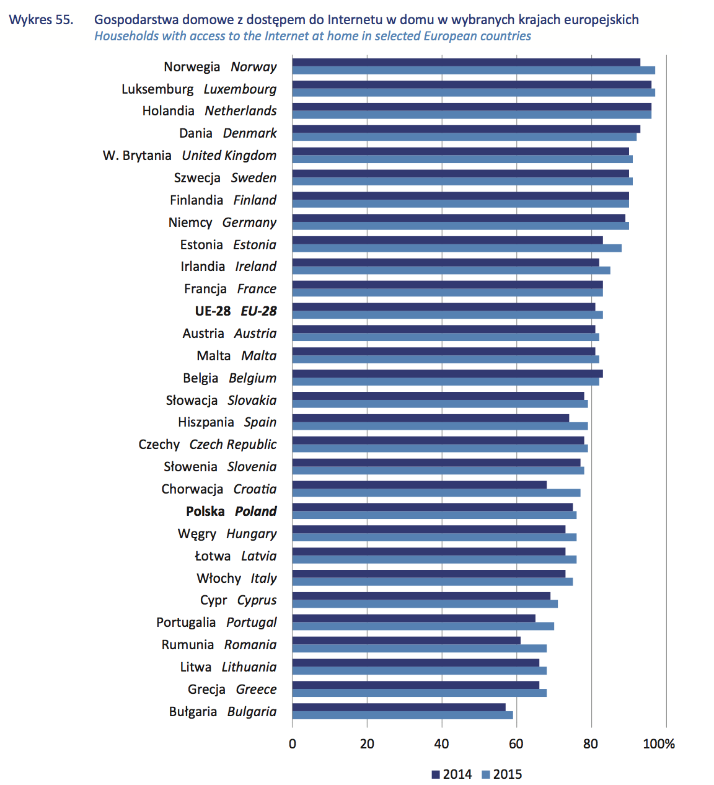
```

## Społeczeństwo informacyjne -- porównanie z Europą -- komputer

```{r, out.width = "1000px",fig.cap='Społeczeństwo informacyjne w Polsce. Wyniki badań statystycznych z lat 2012-2016'}
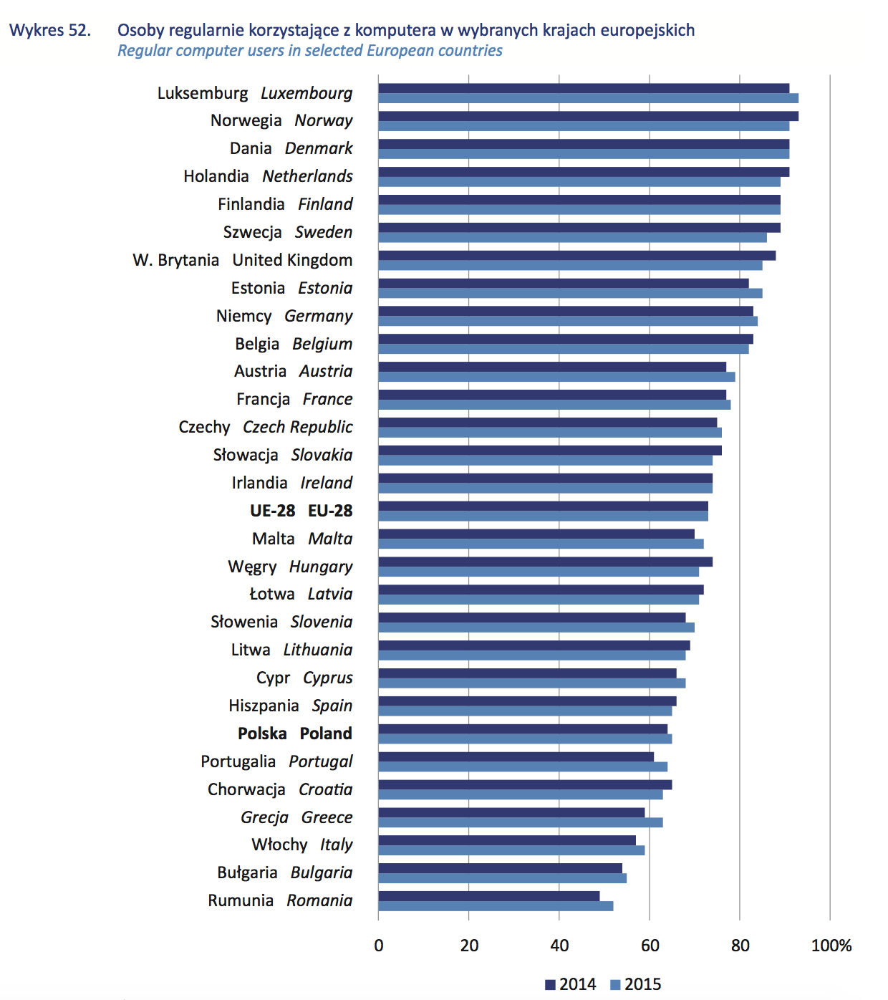
```

## Społeczeństwo informacyjne -- porównanie z Europą -- Internet

```{r, out.width = "1000px",fig.cap='Społeczeństwo informacyjne w Polsce. Wyniki badań statystycznych z lat 2012-2016'}
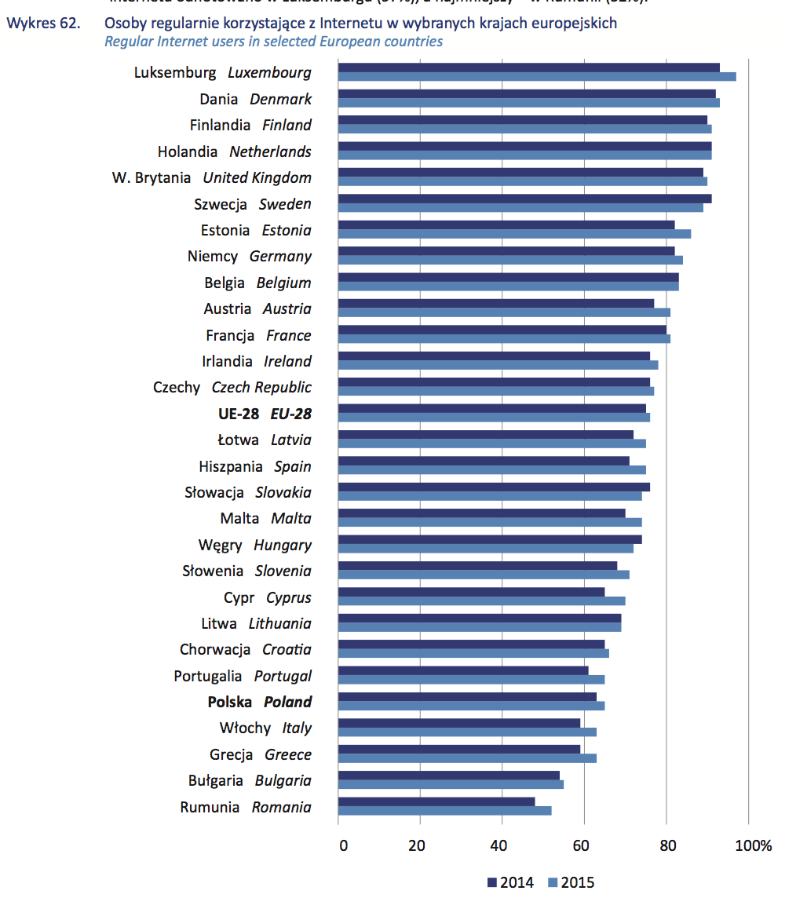
```


## Społeczeństwo informacyjne -- wybrane wyniki

```{r, out.width = "1200px",fig.cap='Społeczeństwo informacyjne w Polsce. Wyniki badań statystycznych z lat 2012-2016'}
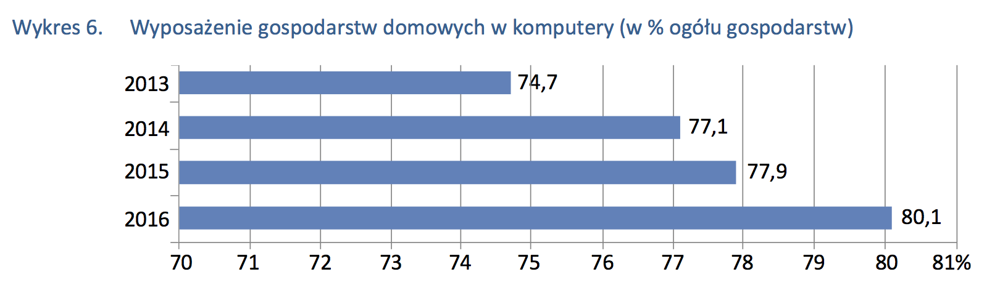
```

## Społeczeństwo informacyjne -- wybrane wyniki

```{r, out.width = "1200px",fig.cap='Społeczeństwo informacyjne w Polsce. Wyniki badań statystycznych z lat 2012-2016'}
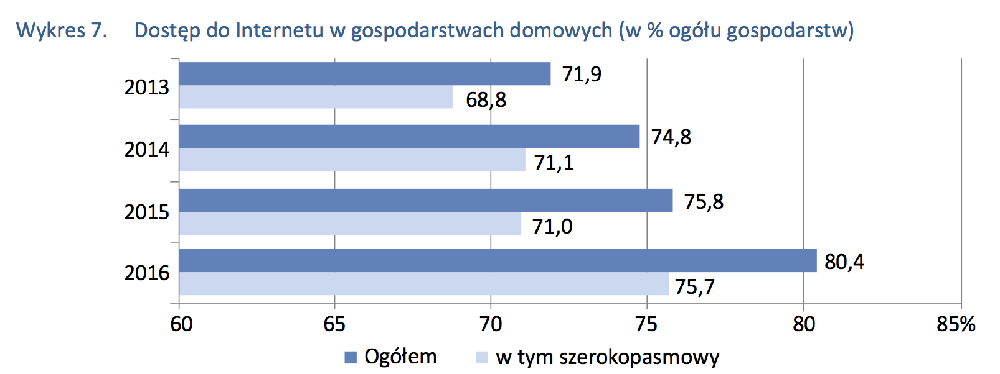
```


## Społeczeństwo informacyjne -- wybrane wyniki

```{r, out.width = "1200px",fig.cap='Społeczeństwo informacyjne w Polsce. Wyniki badań statystycznych z lat 2012-2016'}
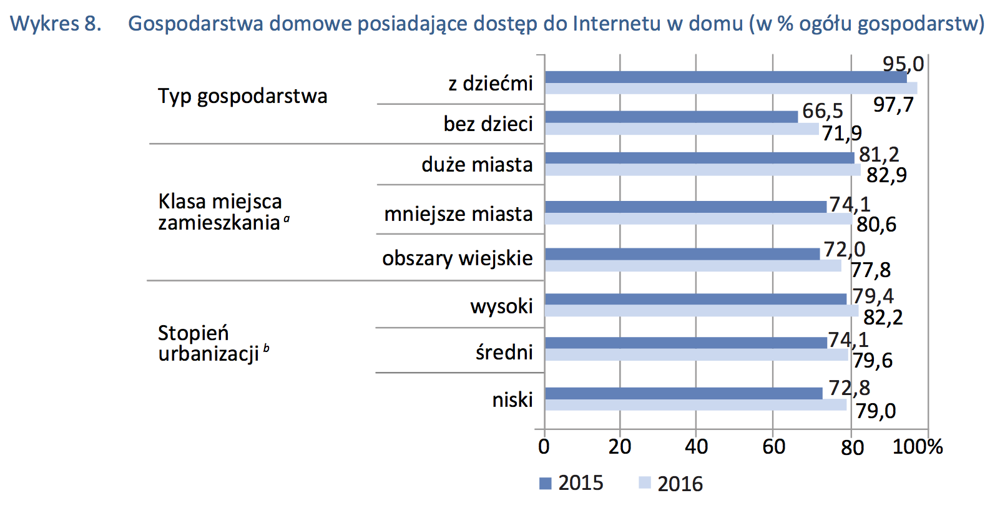
```

## Społeczeństwo informacyjne -- wybrane wyniki

```{r, out.width = "1200px",fig.cap='Społeczeństwo informacyjne w Polsce. Wyniki badań statystycznych z lat 2012-2016'}
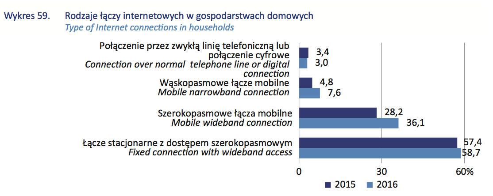
```

## Społeczeństwo informacyjne -- częstotliwość

```{r, out.width = "1200px",fig.cap='Społeczeństwo informacyjne w Polsce. Wyniki badań statystycznych z lat 2012-2016'}
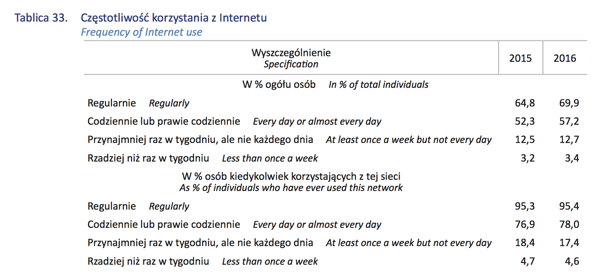
```

## Diagnoza społeczna -- częstotliwość

```{r, out.width = "1200px",fig.cap='Społeczeństwo informacyjne w Polsce. Wyniki badań statystycznych z lat 2012-2016'}
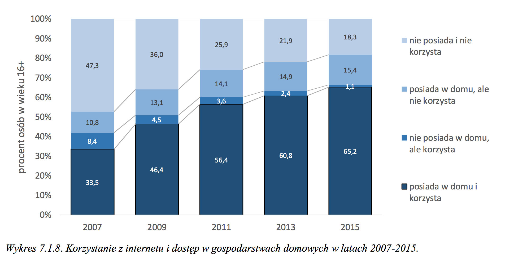
```


## Społeczeństwo informacyjne -- regularnie korzystajacy

```{r, out.width = "1200px",fig.cap='Społeczeństwo informacyjne w Polsce. Wyniki badań statystycznych z lat 2012-2016'}
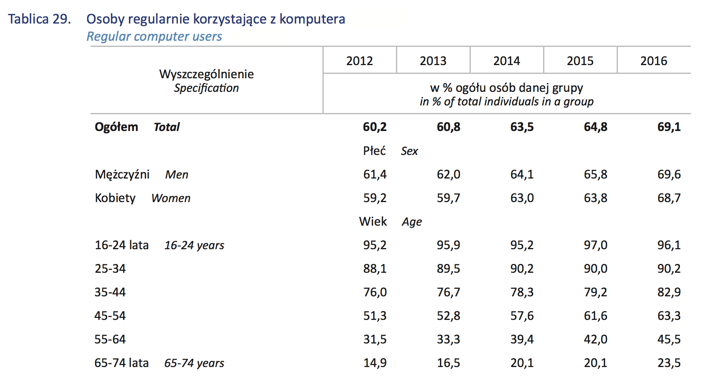
```

## Społeczeństwo informacyjne -- regularnie korzystajacy

```{r, out.width = "1200px",fig.cap='Społeczeństwo informacyjne w Polsce. Wyniki badań statystycznych z lat 2012-2016'}
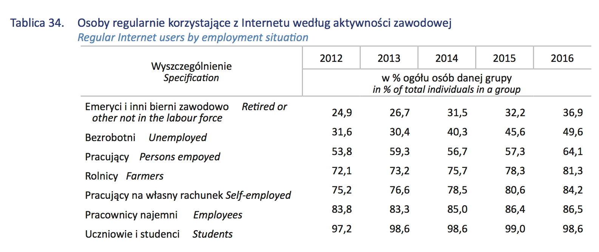
```

## Społeczeństwo informacyjne -- regularnie korzystajacy

```{r, out.width = "1200px",fig.cap='Społeczeństwo informacyjne w Polsce. Wyniki badań statystycznych z lat 2012-2016'}
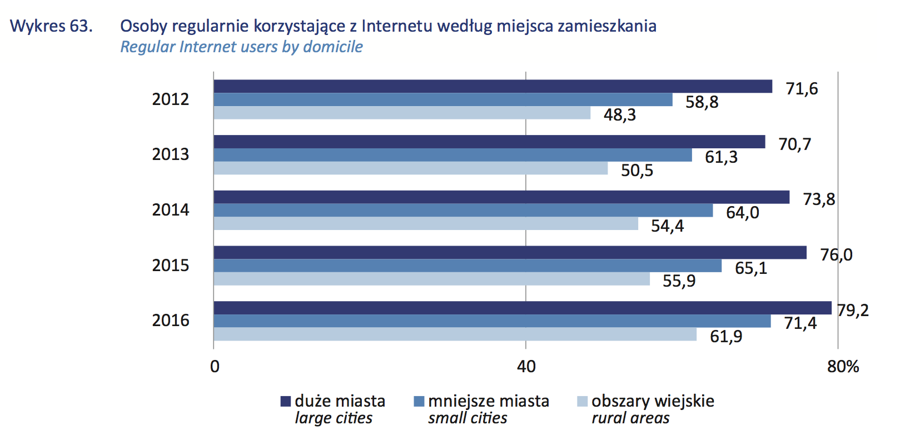
```

## Społeczeństwo informacyjne -- regularnie korzystajacy

```{r, out.width = "1000px",fig.cap='Społeczeństwo informacyjne w Polsce. Wyniki badań statystycznych z lat 2012-2016'}
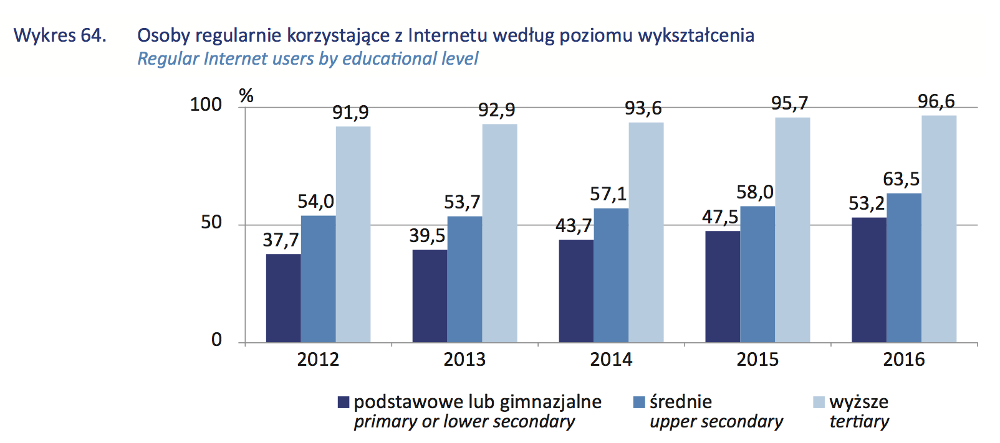
```

## Społeczeństwo informacyjne -- urządzenia mobilne

```{r, out.width = "1000px",fig.cap='Społeczeństwo informacyjne w Polsce. Wyniki badań statystycznych z lat 2012-2016'}
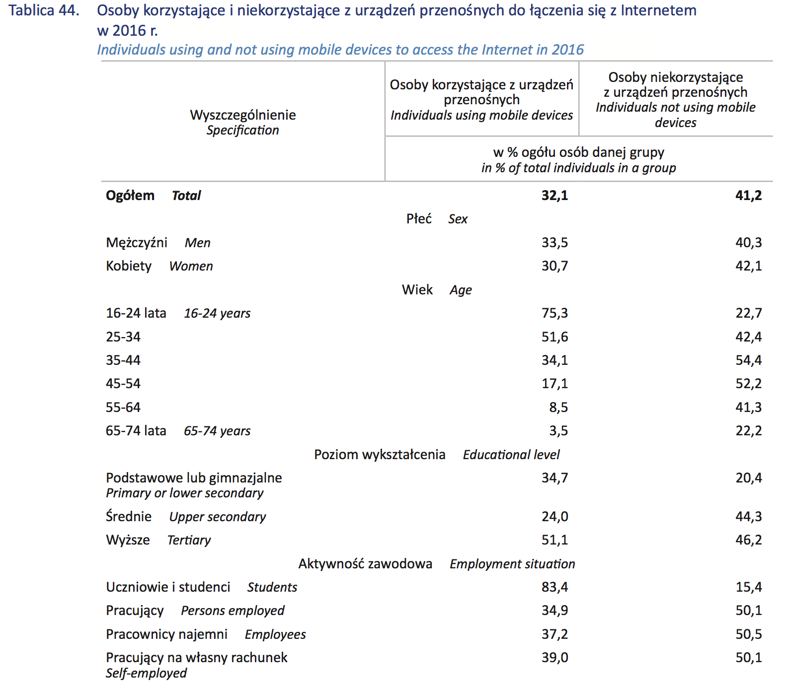
```

## Społeczeństwo informacyjne -- urządzenia mobilne

```{r, out.width = "1000px",fig.cap='Społeczeństwo informacyjne w Polsce. Wyniki badań statystycznych z lat 2012-2016'}
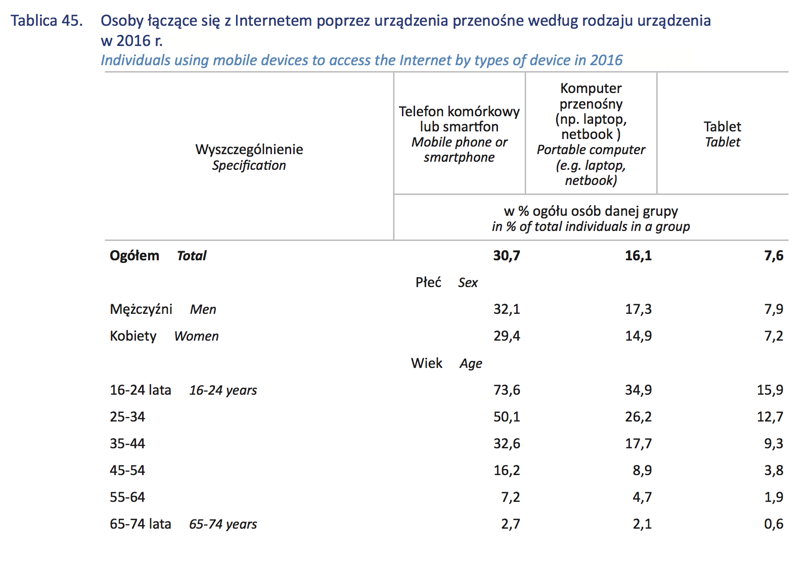
```

## Diagnoza -- urządzenia mobilne

```{r, out.width = "1200px",fig.cap='Diagnoza społeczna. Raport z badań 2003--2015'}
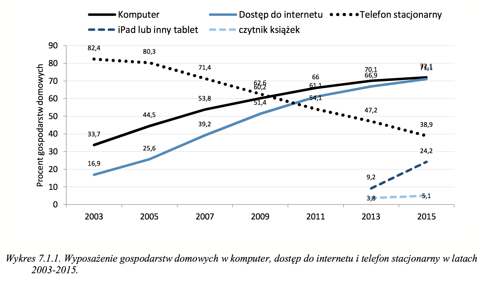
```

## Diagnoza -- urządzenia mobilne

```{r, out.width = "1200px",fig.cap='Diagnoza społeczna. Raport z badań 2003--2015'}
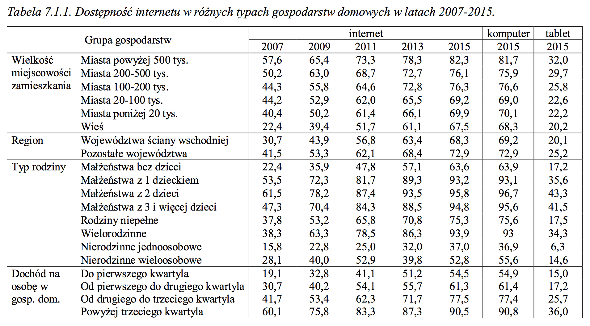
```

## Społeczeństwo informacyjne -- powody niekorzystania

```{r, out.width = "1200px",fig.cap='Społeczeństwo informacyjne w Polsce. Wyniki badań statystycznych z lat 2012-2016'}
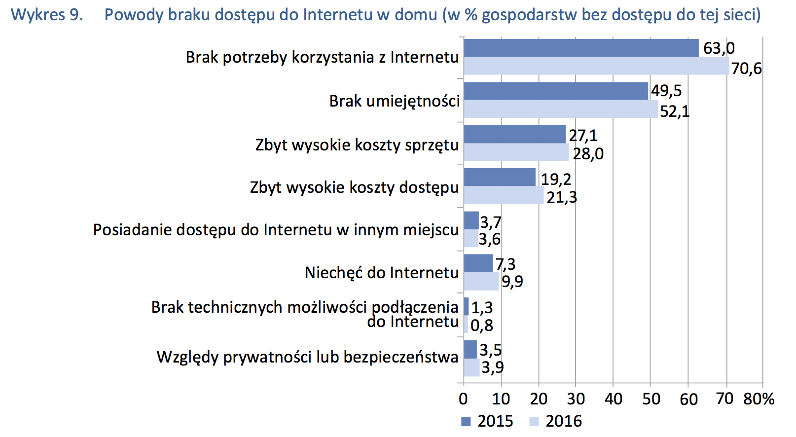
```

## Diagnoza społeczna -- powody niekorzystania

```{r, out.width = "1200px",fig.cap='Diagnoza społeczna. Raport z badań 2003--2015'}
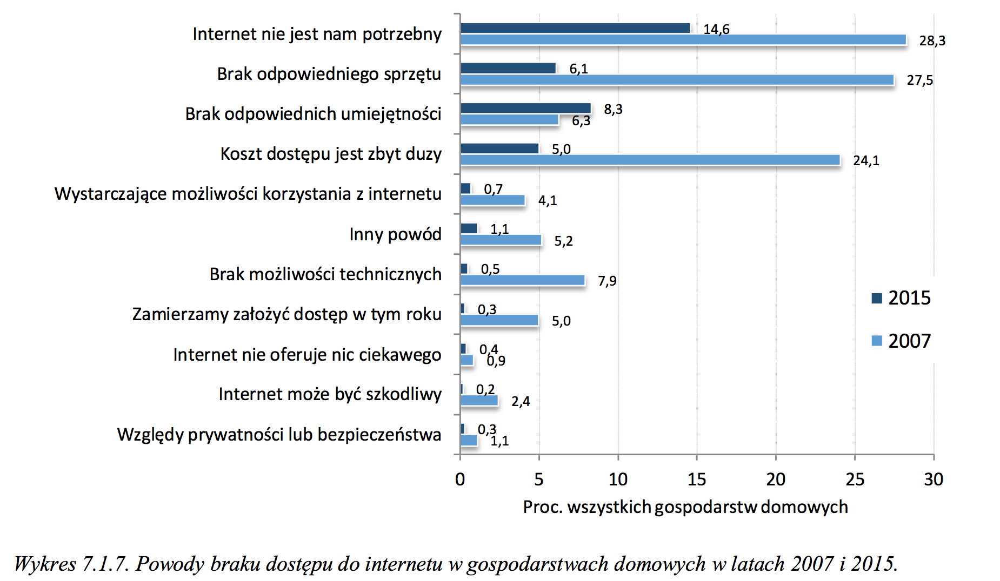
```


## Literatura
