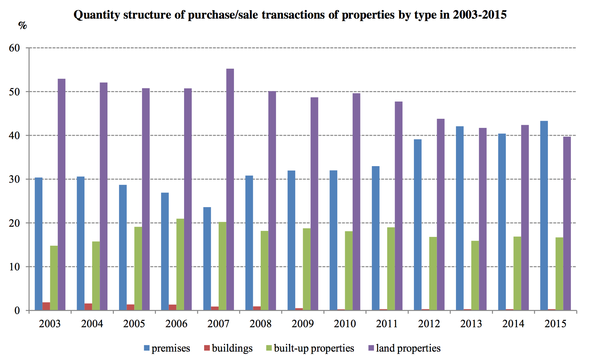

```{r setup, include=FALSE}
library(eurostat)
knitr::opts_chunk$set(echo = FALSE)
```

# Table of Contents

1. Real estate market -- what and how to measure?
2. Data sources on real estate market

# Real estaete -- defintion

+ **real estate** delimited area of lands with all the buildings and facilities (artificial improvements to lands, such as buildings, sewers, pavements, fences and wells) established on it (common meaning)

+ according to the Code of Civil Proceedings art. 46 §1 (Kodeks Cywilny), real estates are:
    + parts of the ground surface;
    + distinct subjects of property (lands);
    + buildings constantly bound with the ground and parts of the buildings if, based on specific regulations, they represent property right which is different from the ground

# Types of real estates - according to the CC (Civil Code - Kodeks Cywilny):

+ land property (nieruchomość gruntowa) -- Superficies solo cedit
+ building property (nieruchomość budynkowa) -- Perpetual usufruct – użytkowanie wieczyste
+ premises property (nieruchomość lokalowa) -- enter in the land and mortgage register

# Real estate market

Real Estate Market:

+ activities and interactions of entities
+ economic activity
+ abstract term
+ agreements (contracts)
+ set of legal procedures
+ forum (place)

**Real Estate Market** -- By the real estate market we mean the whole set of conditions which create the frame for the transfer of property rights connected with the ownership of real estates, for contracts setting. These contracts create new rights and obligations for real estates.

# Real Estate market

Criterions used for real estate market division:

+ subject criterion (according to the type of real estate – its function);
+ spatial criterion (according to the spatial influence);
+ property rights criterion (according to the property rights classification: ownership, leasehold, perpetual usufruct, proprietary coop lease ,etc.);
+ price criterion;

# Real estate market

According to spatial criterion:

+ local market;
+ regional market;
+ domestic market;
+ international market;

# Real estate market -- actors

„Actors” acting on real estate market:

+ investors;
+ developers;
+ purchasers and leaseholders;
+ brokers (pośrednicy);
+ property managers (zarządcy nieruchomości);
+ real estate valuers (rzeczoznawcy);
+ notaries (notariusze);
+ banks;
+ state and local governments;

# Real estate market -- characteristics

+ Economic characteristics
    + scarcity (rzadkość)
    + permanence (trwałość infrastruktury)
    + improvements (wartość może być powiększona o tzw. naniesienia)
    + area preference (lokalizacja)
+ Physical characteristics
    + non-transferability/immobility (nieprzenaszalność)
    + indestructibility (niezniszczalność)
    + nonhomogenity
+ Legal characteristics
    + ownership of the real estate
    + registrated (mortgage/land registers)
    + special form of land dealings (obrót nieruchomościami)
    + partition of built-up property (difficulty)

# Real estate market -- functions

+ trade od goods (towar) 
+ lien/pledge (zastaw);
+ income (dochód);
+ investments (tezauryzacja, lokowanie środków pieniężnych);
+ speculation (spekulacja);
+ property taxes (funkcja fiskalna);

# Real Estate Market -- scope

+ Macro environment
    + Real Estate Stock and Building Activity
    + The Real Estate Industry
    + Demographic Trends
    + Labour Market Data
    + Interest Rates
    + Prices and rents
+ Micro environment
    + Local market
    + Urban / rural
    + Locality, locality, locality...

# Real Estate Market -- data sources

+ Land surveying documentation (dokumentacja geodezyjna)
+ Mortgage registers (księgi wieczyste)
+ Notarial deeds (akty notarialne)
+ Reports and results of conducted analysis
+ Surveys  (based on questionaires)
+ The Internet
+ Newspaper offers

# Research on Real Estate Market in Poland by Central Statistical Office (selected)

+ LIVING CONDITIONS, SOCIAL ASSISTANCE
    + 1.25.01(064) Household budgets
    + 1.25.08(067) European Union Statistics on Income and Living Conditions
    + 1.25.12(070) Poverty and social exclusion
+ DWELLINGS, COMMUNAL INFRASTRUCTURE
    + 1.26.01(073) Housing management
    + 1.26.04(074) Property trade
    + 1.26.06(075) Water, sewerage, heating, gas and electricity infrastructure
    + 1.26.08(076) Municipal solid waste and the maintenance of municipalities in a clean and orderly condition
    + 1.26.09(077) A survey of prices of housing and commercial properties
    + 1.26.10(078) Description of housing resources

Source: [Statistical Research Program of Public Statistics for 2017](http://bip.stat.gov.pl/dzialalnosc-statystyki-publicznej/program-badan-statystycznych/pbssp-2017/)

# Research on Real Estate Market in Poland by Central Statistical Office (selected)

+ AGRICULTURAL AND FORESTRY ACTIVITIES   
    + 1.45.02(124) Land management
    + 1.45.03(125) Land use
+ CONSTRUCTION ACTIVITIES
    + 1.47.01(157) Construction and assembly production; costs listed  by function of expense
    + 1.47.04(158) Building permits issued and building notices submitted for the construction of buildings; effects of construction activities
    + 1.47.05(159) Buildings completed
    + 1.47.06(160) Demolition orders issued
+ REGIONAL STUDIES

Source: [Statistical Research Program of Public Statistics for 2017](http://bip.stat.gov.pl/dzialalnosc-statystyki-publicznej/program-badan-statystycznych/pbssp-2017/)

# Where we can get these data?

+ Publications:
    + Industry, Construction, Fixed Assets -- http://stat.gov.pl/en/topics/industry-construction-fixed-assets/
    + Municipal infrastructure -- http://stat.gov.pl/en/topics/municipal-infrastructure/
        + Real Estate Sales
        + Municipal infrastructure
        + Housing economy
    + National Census of Population and Housing 2011
+ Poland - macroeconomic indicators
    + Selected monthly macroeconomic indicators
    + Quarterly macroeconomic indicators
    + Annual macroeconomic indicators
+ Local data bank -- https://bdl.stat.gov.pl/BDL/dane/podgrup/temat
    + HOUSING ECONOMY AND MUNICIPAL INFRASTRUCTURE
    + INDUSTRY AND CONSTRUCTION
    + LOCAL GOVERNMENT  (eg. taxes)
    

# Research on Real Estate Market in Poland -- National Bank of Poland

+ Realized by NBP:
    + 1.26.09(077) Badanie cen nieruchomości mieszkaniowych i komercyjnych
    
+ Reports:
    + Report on the situation in the Polish residential and commercial real estate market (yearly)
    + House Prices Database - BaRN (2006 Q3 - 2016 Q3)
    + Information on home prices and the situation in the residential and commercial real estate market in Poland  (quarterly)

    
Source: http://www.nbp.pl/homen.aspx?f=/en/publikacje/inne/real_estate_market_pre.html

#

Basic characteristics of real estate market in Europe and Poland


# Housing price statistics - house price index

+ **The house price index**, abbreviated as HPI, is an index that measures the changes in the transaction prices of dwellings purchased by households.

+ **The HPI (Housing Price Index)** shows the price changes of residential properties purchased by households (flats, detached houses, terraced houses, etc.), both newly-built and existing ones, independently of their final use and independently of their previous owners. 

+ HPIs are computed as **Laspeyres-type** annual chain indices allowing weights to be changed each year.

+ The European Union HPIs are calculated as weighted averages of the national HPIs, currently using as weights the GDP at market prices (based on PPS) of the countries concerned.


# Housing price statistics - house price index

```{r, out.width = "1000px",fig.cap='House price indices - euro area and EU aggregates; index levels (2010 = 100), 2016Q3. Source: Eurostat'}


# prc_hpi
```

# Housing price statistics - annual growth rate

```{r, out.width = "1000px",fig.cap='House price indices - euro area and EU aggregates; annual growth rate, 2016Q3. Source: Eurostat'}
knitr::include_graphics("images/rema-annual-growth.png")

# prc_hpi
```

# Housing price statistics - deflated house price index

+ **The deflated HPI** is the ratio between the nominal HPI and an index of consumer price inflation. 
+ A consumer price index, such as the HICP, or a national accounts final consumption deflator can be used for stripping out consumer prices inflation from the HPI.

# Housing price statistics - deflated house price index

```{r, out.width = "1000px",fig.cap='Deflated house price index euro area and EU aggregates; index levels (2010 = 100) – 2016Q3. Source: Eurostat'}


# prc_hpi
```

# Housing price statistics -- Poland

+ Main source for prices: Register of Prices and Values of Real Estates (pol. Rejestr Cen i Wartości Nieruchomości)
+ Covers:
    + premises,
    + building real estate,
    + land real estate.


Source: [Real Estate Market Sales 2015](http://stat.gov.pl/en/topics/municipal-infrastructure/municipal-infrastructure/real-estate-sales-in-2015,2,8.html)

# Real estate market sales in Poland -- definitions

+ **Building real estate** is a building and other facilities permanently connected with the ground, provided that they constitute separate ownership from such land under any specific provisions.
+ **Land real estate** is land with any component parts, excluding buildings and premises, provided that they constitute separate ownership. If a land and mortgage register is kept for the land property, then the land constitutes separate real estate from any other real estate held by the same owner.
+ **Premises** (an independent residential apartment or premises designated for other purposes) refers to a room or set of rooms separated with durable walls within the building dedicated to the permanent stay of persons, which together with the auxiliary rooms serve the purpose of fulfilling their housing needs or which are used according to their dedication for the purposes other than residential ones.


# Real estate market sales -- Poland

+ Basic statistics for 2015:
    + total value 102,6 bilions PLN
    + 412,5k transactions
    

+ Transactions on real estate market in Poland
    + premises (pol. lokale) -- 43.3%
    + land properties (pol. nieruchomości gruntowe) -- 39.7%
    + built-up properties (pol. nieruchomości zabudowane) -- 16.7%
    + buildings (pol. budynki) -- 0.3%

+ Value of transactions on real estate market in Poland
    + premises -- 41.8%
    + built-up properties -- 32.6%
    + land properties -- 25.1%
    + buildings -- 0.5%


# Real estate market sales -- Poland

```{r, out.width = "1000px",fig.cap='Source: GUS'}

```

# Real estate market sales -- Poland

```{r, out.width = "1000px",fig.cap='Source: GUS'}

```

# Real estate market sales -- Poland

```{r, out.width = "1000px",fig.cap='Source: GUS'}
knitr::include_graphics("images/sales-overall-value.png")
```

# Real estate market sales -- Poland

```{r, out.width = "1000px",fig.cap='Source: GUS'}

```

# Real estate market sales -- Poland

```{r, out.width = "1000px",fig.cap='Source: GUS'}

```

# Real estate market sales -- Poland

```{r, out.width = "1000px",fig.cap='Source: GUS'}

```

# Real estate market sales -- Poland

```{r, out.width = "1000px",fig.cap='Source: GUS'}

```

# Real estate market sales -- Residential premesis

+ Turnover form in 2015:
    + Free market (91.0% -- #trans, 95.6% -- value)
    + Sale without tender procedure (8.0% -- #trans, 3.9% -- value)
    + Sale under tender procedure (1% -- #trans, 0.5% -- value)

+ Market type in 2015:
    + secondary market (61.9% -- #trans, 52.0% -- value)
    + primary market (38.1% -- #trans, 48% -- value)
    
    

# Real estate market sales -- Residential premesis

```{r, out.width = "1000px",fig.cap='Source: GUS'}

```

# Real estate market sales -- Residential premesis

```{r, out.width = "1000px",fig.cap='Source: GUS'}

```


# Real estate market sales -- Residential premesis

```{r, out.width = "1000px",fig.cap='Source: GUS'}

```

# Real estate market sales -- Residential premesis

```{r, out.width = "1000px",fig.cap='Source: GUS'}

```

# Real estate market sales -- Residential premesis - prices


```{r, out.width = "1000px",fig.cap='Source: GUS'}

```

# Real estate market sales -- Residential premesis - prices

```{r, out.width = "1000px",fig.cap='Source: GUS'}

```

# EU-SILC -- basic information

+ The EU statistics on income and living conditions, abbreviated as EU-SILC,
+ EU-SILC provides two types of annual data:
    + cross-sectional data pertaining to a given time or a certain time period with variables on income, poverty, social exclusion and other living conditions;
    + longitudinal data pertaining to individual-level changes over time, observed periodically over a four-year period.
+ EU-SILC is a multi-purpose instrument which focuses mainly on income,
+ EU-SILC is based on the idea of a common “framework” and no longer a common “survey”. The common framework defines:
    + the harmonised lists of target primary (annual) and secondary (every four years or less frequently) variables to be transmitted to Eurostat;
    + common guidelines and procedures;
    + common concepts (household and income) and classifications aimed at maximising comparability of the information produced.
+ **The reference population** in EU-SILC includes all private households and their current members residing in the territory of the countries at the time of data collection. All household members are surveyed, but only those aged 16 and more are interviewed.

# EU-SILC -- basic information

+ EU-SILC is a non-obligatory, representative questionnaire survey of individual households, carried out by the face-to-face interview technique,
+ For individual interviews **a proxy interview** is allowed with another household member,
+ The information concerning the household as a whole is recorded in the household and the individual questionnaire.

# EU-SILC -- in Poland

+ A two-stage sampling scheme with different selection probabilities at the first stage was used. Primary sampling units (PSU) were enumeration census areas.
+ At the second stage dwellings were selected. 
+ All the households from the selected dwellings were supposed to enter the survey.
+ Prior to selection, primary sampling units were stratified (the voivodships, class of locality)
+ Completeness indicators according to class of locality:
    + Poland -- **0.554**
    + Warsaw -- 0.390
    + Towns 500k+ - 1mln inhabitants -- 0.419
    + Towns 100k - 500k inhabitants -- 0.483
    + Towns 20k - 100k inhabitants -- 0.536
    + Towns less than 20k inhabitants -- 0.559
    + Rural areas -- 0.681

EU-SILC methodology -- [LINK](http://stat.gov.pl/obszary-tematyczne/warunki-zycia/dochody-wydatki-i-warunki-zycia-ludnosci/dochody-i-warunki-zycia-ludnosci-polski-raport-z-badania-eu-silc-2014,6,8.html)

# EU-SILC -- questions devoted to housing

+ Income (AVERAGE YEARLY PER CAPITA NET INCOME):
    + Housing allowances (pol. Dodatki Mieszkaniowe),
    + Property tax (pol. Podatki od Nieruchomości),
+ SELECTED DATA ON THE DWELLING CONDITIONS OF HOUSEHOLDS BY CLASS OF LOCALITy:
    + Type of building:
        + detached house (pol. dom jednorodzinny wolnostojący)
        + semi-detached house (pol. dom jednorodzinny w zabudowie szeregowej)
        + apartment in a building with less than 10 dwellings (pol. budynek z mniej niż 10 lokalami mieszkalnymi)
        + apartment in a building with 10 or more dwellings (pol. budynek z 10 i więcej lokalami mieszkalnymi)
        + other
    + Dwelling equipped with: cold running water, flush toilet, bath or shower, hot water (from the central system or heated locally), gas (from the central network or from the cylinder).


Source: https://circabc.europa.eu/faces/jsp/extension/wai/navigation/container.jsp


# EU-SILC -- Distribution of population by dwelling type, 2015 (% of population)

```{r, out.width = "1000px",fig.cap='Distribution of population by dwelling type, 2015 (% of population). Source: Eurostat'}


# ilc_lvho01
```

# EU-SILC -- Distribution of population by tenure status, 2015 (% of population)

```{r, out.width = "1000px",fig.cap='Distribution of population by tenure status, 2015 (% of population). Source: Eurostat'}


# ilc_lvho02
```

# EU-SILC -- Overcrowding rate, 2015

**The overcrowding rate** describes the proportion of people living in an overcrowded dwelling, as defined by the number of rooms available to the household, the household’s size, as well as its members’ ages and their family situation.

A person is considered as living in an overcrowded household if the household does not have at its disposal a minimum number of rooms equal to:

+ one room for the household;
+ one room per couple in the household;
+ one room for each single person aged 18 or more;
+ one room per pair of single people of the same gender between 12 and 17 years of age;
+ one room for each single person between 12 and 17 years of age and not included in the previous category;
+ one room per pair of children under 12 years of age.


**The population at risk of poverty** people living in households where equivalised disposable income per person was below 60 % of the national median.
 
# EU-SILC -- Overcrowding rate, 2015

```{r, out.width = "1000px",fig.cap='Overcrowding rate, 2015 (% of specified population). Source: Eurostat'}


# ilc_lvho05a
```


# EU-SILC -- Severe housing deprivation, 2014 and 2015

**The severe housing deprivation rate** is defined as the proportion of persons living in a dwelling which is considered as being overcrowded, while having at the same time at least one of these aforementioned housing deprivation measures.

Housing deprivation is a measure of poor amenities and is calculated by referring to those households with a leaking roof, no bath/shower and no indoor toilet, or a dwelling considered too dark.

# EU-SILC -- Severe housing deprivation, 2014 and 2015

```{r, out.width = "1000px",fig.cap='Overcrowding rate, 2015 (% of specified population). Source: Eurostat'}


# ilc_mdho06a
```

# EU-SILC -- Housing cost overburden rate by tenure status, 2015

**The housing cost overburden rate** is the percentage of the population living in households where the total housing costs ('net' of housing allowances) represent more than 40 % of disposable income ('net' of housing allowances).

# EU-SILC -- Housing cost overburden rate by tenure status, 2015


```{r, out.width = "1000px",fig.cap='Housing cost overburden rate by tenure status, 2015 (% of specified population). Source: Eurostat'}


# ilc_lvho07c 
# ilc_lvho07a
```

# EU-SILC -- dwelling conditions in Poland


```{r, out.width = "1000px",fig.cap='Selected data on the dwelling conditions of households by regions. Source: GUS'}


```

# EU-SILC -- dwelling conditions in Poland

```{r, out.width = "1000px",fig.cap='Selected data on the dwelling conditions of households by regions. Source: GUS'}

```


