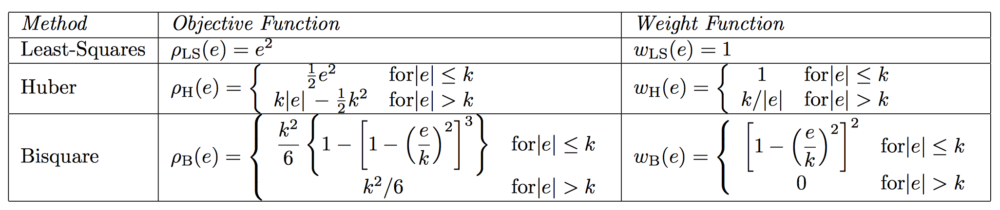

# Theory

Based on https://socserv.socsci.mcmaster.ca/jfox/Books/Companion/appendix/Appendix-Robust-Regression.pdf

## M-Estimation

The most common general method of robust regression is M-estimation, introduced by Huber (1964). This class of estimators can be regarded as a generalization of maximum-likelihood estimation, hence the "M". Although M estimators are not robust with respect to leverage points, they are popular in applications where leverage points are not an issue.

We consider only the linear model 

$$
y_i = \boldsymbol{x}_i'\boldsymbol{\beta} + \epsilon_i
$$
for the $i$-th observation of $n$ independent observations. We assume that the model itself is not at issue, $E(y |\boldsymbol{x}) =  \boldsymbol{x}_i'\boldsymbol{\beta}$, but the distribution of the errors may be heavy-tailed, producing occasional outliers. 

Residuals are given by

$$
e_i = y_i - \hat{y}_i = y_i - \boldsymbol{x}_i'\boldsymbol{b}
$$
In M -estimation, the estimates $\boldsymbol{b}$ are determined by minimizing a particular objective function over all $\boldsymbol{b}$.

$$
\sum_{i=1}^n\rho(e_i) = \sum_{i=1}^n\rho(y_i - \boldsymbol{x}_i'\boldsymbol{b}),
$$

where function $\rho$ should have the following properties:

+ always-non negative,
+ $\rho(0) = 0$,
+ symmetric -- $\rho(-e) = \rho(e)$,
+ monotone in $|e_i|$, $\rho(e_i) \geq \rho(e_i')$ for $|e_i| \geq |e_i'|$

For example, the least-squares $\rho(e_i) = e_i^2$ satisfies these requirements, as do many other
functions.

## Computing of M-estimates

The minimum value of Equation 1 can be found by differentiating with respect to the argument b,
and setting the resulting partial derivatives to 

$$
\boldsymbol{0} = \frac{\partial}{\partial \boldsymbol{b}} \sum_{i=1}^{n}\rho(y_i - \boldsymbol{x}_i^\prime\boldsymbol{b}) = \sum_{i=1}^n\psi(y_i - \boldsymbol{x}_i'\boldsymbol{b})\boldsymbol{x}_i'
$$
where the influence curve $\psi$ is is defined to be the derivative of $\rho$ with respect to its argument.

To facilitate computing, we would like to make this last equation similar to the estimating equations for a familiar problem like weighted least squares. To this end, define the weight function $w_i=w(e_i)=\psi(e_i)/e_i$

$$
\sum_{i=1}^nw(y_i - \boldsymbol{x}_i'\boldsymbol{b})\boldsymbol{x}_i' = \boldsymbol{0}
$$
An iterative solution (called iteratively reweighted least-squares, IRLS) is therefore required:

1. Select initial estimates $\boldsymbol{b}^{0}$, such as the least-squares estimates.
2. At each iteration $t$,  calculate residuals $e_i^{(t-1)}$ and associated weights $w_i^{(t-1)}=w\left[e_i^{t=1} \right]$.
3. Solve for new weighted-least-squares estimates

$$
\boldsymbol{b}^{(t)} = \left[\boldsymbol{X}'\boldsymbol{W}^{(t-1)}\boldsymbol{X}\right]^{-1}\boldsymbol{X}'\boldsymbol{W}^{(t-1)}\boldsymbol{y},
$$

where $\boldsymbol{X}$ is the model matrix, with $\boldsymbol{x}_i'$ as its $i$th row, and $\boldsymbol{W}^{(t-1)} = diag\left\{ w_{i}^{t-1}\right\}$ in the current weight matrix.

Steps 2 and 3 are repeated until the estimated coefficients converge.



Inne funkcje -- http://support.sas.com/documentation/cdl/en/statug/68162/HTML/default/viewer.htm#statug_rreg_details01.htm#statug.rreg.robustregfweightfunction


# Bounded-Influence Regression

Under certain circumstances, M-estimators can be vulnerable to high-leverage observations. Very- high-breakdown bounded-influence estimators for regression have been proposed. 

The breakdown value of an estimator is the smallest contamination fraction of the data that can cause the estimates on the entire data to be arbitrarily far from the estimates on only the uncontaminated data. The breakdown value of an estimator can be used to measure the robustness of the estimator. Rousseeuw and Leroy (1987) and others introduced the following high breakdown value estimators for linear regression.

One bounded-influence estimator is least-trimmed squares (LTS) regression. Order the squared residuals from smallest to largest

$$
(e^2)_{(1)},(e^2)_{(2)},...,(e^2)_{(n)}
$$

The LTS estimator chooses the regression coefficients $\boldsymbol{b}$ to minimize the sum of the smallest $m$ of the squared residuals.

$$
LTS(\boldsymbol{b}) = \sum_{i=1}^m(e^2)_{(i)},
$$
where typicaly $m = \lfloor n/2 \rfloor + \lfloor (k+2)/2 \rfloor$. While the LTS criterion is easily described, the mechanics of fitting the LTS estimator are complicated. Moreover, bounded-influence estimators can produce unreasonable results in certain circumstances and there is no simple formula for coefficient standard errors.

## MM-Estimation

One application of bounded-influence estimators is to provide starting values for M-estimation. This procedure, along with using the bounded-influence estimate of the error variance, produces the so-called MM-estimator. The MM -estimator retains the high breakdown point of the bounded- influence estimator and shares the relatively high efficiency under normality of the traditional M -estimator. MM -estimators are especially attractive when paired with redescending 𝜓-functions such as the bisquare, which can be sensitive to starting values.


## Methods available in R packages

+ MASS::lqs, method:
    + lts, 
    + lqs,
    + lms, 
    + S

# Example

Packages

```{r}
library(MASS)
library(robust)
library(robustbase)
```

Functions:

+ MASS:rlm -- robust linear regession (e.g. the Huber M-estimator)

```{r}
rema <- read.csv2('../data-raw/project_data_train.csv', 
                 header = T, 
                 stringsAsFactors = F, 
                 dec = '.')
rema
```

## Linear regression model

```{r}
model1 <- lm(trans_dwelling_price ~ trans_dwelling_floor_area, data = rema)
summary(model1)
qqnorm(model1$residuals)
```

## Robust LM: M-estimation approach

```{r}
model2 <- MASS::rlm(trans_dwelling_price ~ trans_dwelling_floor_area, data = rema)
summary(model2)
```

```{r}
qqnorm(model2$w) ## the weights used in the IWLS process
```

```{r}
plot(rema$trans_dwelling_floor_area,
     rema$trans_dwelling_price,
     xlab = 'Floor area',
     ylab = 'Price')
abline(coef(model1), col = 'red')
abline(coef(model2), col = 'blue')
```

## Robust LM: MM-estimation approach

```{r}
model3 <- MASS::rlm(trans_dwelling_price ~ trans_dwelling_floor_area, 
                    data = rema, method = 'MM')
summary(model3)
```


```{r}
qqnorm(model3$w) ## the weights used in the IWLS process
```

```{r}
model3 <- lmRob(trans_dwelling_price ~ trans_dwelling_floor_area,
              data = rema)
summary(model3)
```

The ‘test for bias’ is of the M-estimator against the initial S-estimator; if the M-estimator appears biased the initial S-estimator is returned.

```{r}
model4 <- lmrob(trans_dwelling_price ~ trans_dwelling_floor_area,
                data = rema)
summary(model4)
qqnorm(model4$rweights)
```


## ltsReg

```{r}
model5 <- robustbase::ltsReg(trans_dwelling_price ~ trans_dwelling_floor_area,
                            data = rema)
summary(model5)
```


