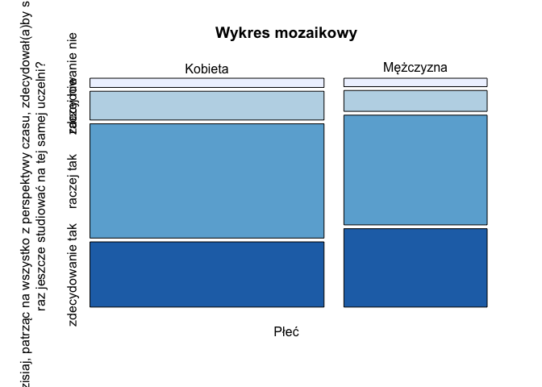
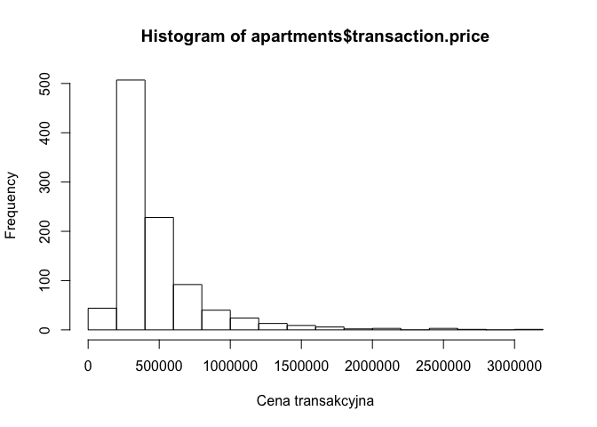
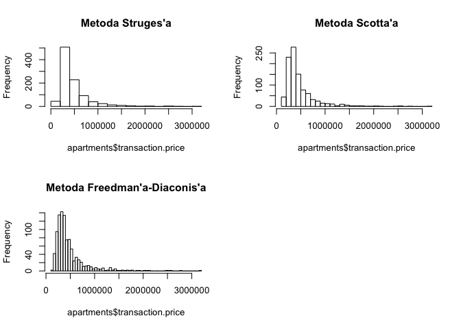
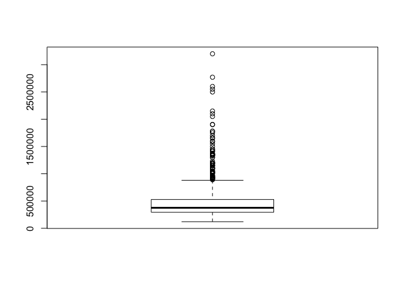
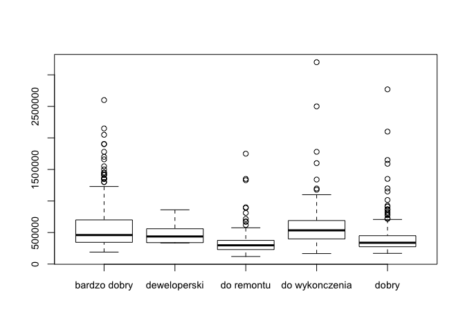

# WIRDS 1 -- Podstawowe wykresy
Maciej Beręsewicz  
  


# Słowo wstępu

Materiały na zajęcia poświęcone podstawowym wykresom statystycznym, które wykorzystywane są do poglądowej analizy danych (ang. *exploratory data analysis*, EDA). W ramach zajęć przedstawione i wyjaśnione zostaną następujące wykresy:

* Zmienne na skali nominalnej i porządkowej (zm. jakościowe)
    + kołowy (ciastkowy) -- ang. *pie chart*
    + słupkowy (paskowy) -- ang. *bar plot*
    + mozaikowy -- ang. *mosaic plot*
* Zmienne na skali przedziałowej i ilorazowej (zm. ilościowe)
    + rozrzutu -- ang. *scatter plot*
    + histogram -- ang. *histogram*
    + gęstości -- ang. *density plot*
    + pudełkowy (ramka wąsy) -- ang. *boxplot*
    + skrzypcowy -- ang. *violin plot*

## Wczytanie danych dotyczących badania studentów

W przykładach będziemy wykorzystywali następujące dane:

* `bkl` -- zbiór danych pochodzących z badania studentów z edycji 2010 i 2013. 
* `apartments` -- zbiór dotyczący ceny ofertowe i transakcyjne mieszkań sprzedanych w latach 2007--2009. Zbiór dostępny jest w pakiecie `PBImisc`.


```r
bkl <- rio::import(file = '../datasets/BKL_studenci_1_4ed.sav')
data('apartments', package = 'PBImisc')
```

## Wykresy jednowymiarowe -- cechy jakościowe

### Wykres kołowy

Jednym z podstawowych wykresów do prezentacji danych na skali **nominalnej** jest wykres kołowy. Stosujemy go w przypadku gdy badana zmienna przyjmuje nie dużą liczbę wariantów (np. 4-6). W **R** jest funkcja *pie*, która służy do tworzenia tego typu wykresu. Składnię można znaleźć poniżej.


```r
pie(x, labels = names(x), edges = 200, radius = 0.8,
    clockwise = FALSE, init.angle = if(clockwise) 90 else 0,
    density = NULL, angle = 45, col = NULL, border = NULL,
    lty = NULL, main = NULL, ...)
```

Stworzymy wykres kołowy przedstawiający liczebność `reprezentantów`^[Używamy pojęcia reprezentant ponieważ interesuje nas struktura próby, a nie struktura populacji. W przeciwnym wypadku powinniśmy użyć wag analitycznych (jeżeli interesują nas struktury) lub wag "populacyjnych" (jeżeli interesują nas wartości globalne)] w próbie według typu uczelni (`kod_A1_1min`). Polecam najpierw utworzyć tabelę, a następnie na jej podstawie stworzyć wykres kołowy. 


```r
uczelnie <- table(bkl$kod_A1_1min)
pie(uczelnie)
```

<!-- -->

W przeciwnym wypadku tworzenie wykresu będzie trwało bardzo długo lub w ogóle się nie wykona. Jeżeli chcemy zmienić wygląd wykresu możemy skorzystać z dodatkowych opcji. Kolory ustawiamy podając wektor wartości w argumencie col. W tym przypadku korzystamy z funkcji brewer.pal z pakietu RColorBrewer (inny zapis: RColorBrewer::brewer.pal).


```r
etykiety <- attr(bkl$kod_A1_1min,'labels')
pie(x = uczelnie,
    labels = names(etykiety),
    clockwise =  T)
```

<!-- -->

**Wykresy kołowe nie są jednak polecane do wizualizacji danych**. Dlaczego?

* zakłamują proporcje (na co patrzymy?)
* nie nadają się do porównań.

### Wykres słupkowy (paskowy)

Kolejnym rozpatrywanym typem wykresu jest wykres słupkowy (nazywany również paskowym). Stosujemy go to przedstawiania danych jedno lub dwuwymiarowych na skali nominalnej oraz porządkowej. W **R** znaleźć możemy procedurę *barplot*, która służy do rysowania wykresów słupkowych.

Składnia funkcji jest następująca,


```r
barplot(height, width = 1, space = NULL,
        names.arg = NULL, legend.text = NULL, beside = FALSE,
        horiz = FALSE, density = NULL, angle = 45,
        col = NULL, border = par("fg"),
        main = NULL, sub = NULL, xlab = NULL, ylab = NULL,
        xlim = NULL, ylim = NULL, xpd = TRUE, log = "",
        axes = TRUE, axisnames = TRUE,
        cex.axis = par("cex.axis"), cex.names = par("cex.axis"),
        inside = TRUE, plot = TRUE, axis.lty = 0, offset = 0,
        add = FALSE, args.legend = NULL, ...)
```


Najważniejszym argumentem jest parametr *weight* określającym wysokość słupków. Argument *beside* mówi o tym czy wartości będą przedstawione w postaci słupków stack czy obok sobie. Natomiast *horiz* wskazuje położenie słupków.

Przedstawimy teraz dane dotyczące liczby reprezentantów według typu uczelni.


```r
barplot(uczelnie)
```

<!-- -->

Zmienimy teraz kilka podstawowych opcji.


```r
### sortujemy wartosci
uczelnie <- sort(uczelnie, decreasing = F)

### tworzymy wykres
barplot(uczelnie,
        horiz = T,
        col = 'red',
        cex.axis = 1,
        cex.names = .8)
```

<!-- -->

### Wykres mozaikowy

Kolejnym wykresem jest wykres mozaikowy, który jest wizualizacją tabeli krzyżowej (ang. *cross table*). Wysokość i szerokość przedstawiają dwa wymiary danych (procenty wierszowe i kolumnowe). Możemy go bezpośrednio stosować na obiekcie klasy **xtabs** i **table**. Poniżej znajduje się składnia funkcji mosaic.


```r
mosaicplot(x, main = deparse(substitute(x)),
           sub = NULL, xlab = NULL, ylab = NULL,
           sort = NULL, off = NULL, dir = NULL,
           color = NULL, shade = FALSE, margin = NULL,
           cex.axis = 0.66, las = par("las"), border = NULL,
           type = c("pearson", "deviance", "FT"), ...)
```

Zobaczymy czym różni się wywołanie funkcji **plot** na obiekcie klasy **xtabs**, a później jak zmieni się wykres jeżeli zastosujemy funkcję **mosaicplot** (nie ma różnicy). Sprawdzimy czy studenci wybraliby raz jeszcze daną uczelnię (`Czy dzisiaj, patrząc na wszystko z perspektywy czasu, zdecydował(a)by się Pan(i) raz jeszcze studiować na tej samej uczelni?` -- `C1`) wg Płci (`M1`).


```r
edycja_c1 <- xtabs(~M1 + C1, data = bkl)
plot(edycja_c1)
```

<!-- -->


```r
colnames(edycja_c1) <- names(attr(bkl$C1,'labels'))[4:7]
rownames(edycja_c1) <- c('Kobieta','Mężczyzna')

mosaicplot(edycja_c1,
           main = 'Wykres mozaikowy',
           margin = 2, ### określenie marginesów
           color = RColorBrewer::brewer.pal(4, 'Blues'), ### określenie kolorów
           cex.axis = 1,  ### czcionka osi
           border = 'black', ### obramowanie
           ylab = 'Czy dzisiaj, patrząc na wszystko z perspektywy czasu, zdecydował(a)by się Pan(i) \nraz jeszcze studiować na tej samej uczelni?', ### etykieta osi OX
           xlab = 'Płeć', ### etykieta osi OY
           off = 5) ### przetrzeń między elementami mozaiki
```

<!-- -->


Oczywiście możemy ten wykres dopracować. Warto go stosować do prezentacji danych tabelarycznych ponieważ od razu możemy zauważyć zależności w tabeli. 


## Wykresy jednowymiarowe -- cechy ciągłe

### Histogram

Podstawowym wykresem do prezentacji rozkładów zmiennych jest histogram. Różni się od wykresu paskowego tym, że poszczególne słupki przylegają do siebie. Wynika to z tego, że zanim histogram jest tworzony dane są dzielone na określoną liczbę przedziałów. Do tworzenia histogramów w  **R**  służy funkcja **hist**, której składnia przedstawiona jest poniżej. 


```r
hist(x, breaks = "Sturges",
     freq = NULL, probability = !freq,
     include.lowest = TRUE, right = TRUE,
     density = NULL, angle = 45, col = NULL, border = NULL,
     main = paste("Histogram of" , xname),
     xlim = range(breaks), ylim = NULL,
     xlab = xname, ylab,
     axes = TRUE, plot = TRUE, labels = FALSE,
     nclass = NULL, warn.unused = TRUE, ...)
```


```r
hist(apartments$transaction.price,
     xlab = 'Cena transakcyjna')
```

<!-- -->

Histogram może przedstawiać zarówno częstości występowania poszczególnych przedziałów, jak i prawdopodobieństwo wystąpienia (opcja *freq*). *Breaks* określa liczbę tworzonych przedziałów (powinny być tak utworzone aby nie zawierały pustych przedziałów). W **R** są możemy wybrać między trzeba metodami tworzenia przedziałów:

* Struges - wzór: $k+log_2n$
* Scott - wzór: $3.5sn^{-1/3}$
* FD (Freedman i Diaconis (1981)) - wzór: $2Rn^{-1/3}$

gdzie $n$ to wielkość próby, $s$ to odchylenie standardowe, $R$ to rozstęp międzykwartylowy ($Q_3-Q_1$).


Utwórzmy histogram wykorzystując te trzy miary i spójrzmy na różnice


```r
par(mfrow = c(2, 2))
hist(apartments$transaction.price, breaks = 'sturges', main = "Metoda Struges'a")
hist(apartments$transaction.price, breaks = 'scott', main = "Metoda Scotta'a")
hist(apartments$transaction.price, breaks = 'fd', main = "Metoda Freedman'a-Diaconis'a")
par(mfrow = c(1, 1))
```

<!-- -->

Proszę zwrócić uwagę, że metoda Scotta oraz Friedmana-Diaconis'a tworzy większą liczbę przedziałów, przez co może wpływać na czytelność danych. Rozkład badanej cechy charakteryzuje się asymetrią prawostronną oznacza to, że w zbiorze danych występują wagi ekstremalne (jak na zachowywanie struktury przez tzw. wagi analityczne).

Analiza histogramu dla danych zlogarytmowanych pozwoli nam wskazać czy ten sposób transformacji zbliża rozkład danej cechy do rozkładu normalnego.


```r
par(mfrow = c(1, 2))
hist(x = log10(apartments$transaction.price),
     xlab = 'Cena transakcyjna',
     main = 'Histogram log_10(Cena transakcyjna)',
     breaks = 'fd')
hist(x = log(apartments$transaction.price),
     xlab = 'Cena transakcyjna',
     main = 'Histogram log_e(Cena transakcyjna)',
     breaks = 'fd')
```

<!-- -->

```r
par(mfrow = c(1, 1))
```


Histogram stosujemy do prezentacji danych jednowymiarowych.

O czym musimy jeszcze pamiętać? 

* częstości (`freq`) czy prawdopodobieństwo (`probability`),
* czy wartości skrajne (najmniejsze, największe) mają być włączone (`include.lowest`),
* czy przedziały mają być zamknięte prawostronnie (`right`) -- `(a,b]` czy `[a,b)`


### Wykres gęstości

W kolejnym podpunkcie omówimy wizualizację pewnej metody statystycznej, którą jest wykres gęstości. Opiera się ona na jądrowej estymacji parametrów rozkładu badanej zmiennej. Co to oznacza? Na podstawie danych estymowane są parametry rozkładu zmiennej tak aby móc przedstawić wykres gęstości. Wykorzystujemy tę miarę w kilku celach:

* wizualnej weryfikacji zgodności z zadanym rozkładem
* wizualizacji zmiany rozkładów badanej cechy w czasie

W **R** najpierw musimy zastosować funkcję **density**, a następnie jej wynik wywołać funkcją plot.


```r
density(x, bw = "nrd0", adjust = 1,
        kernel = c("gaussian", "epanechnikov", "rectangular",
                   "triangular", "biweight",
                   "cosine", "optcosine"),
        weights = NULL, window = kernel, width,
        give.Rkern = FALSE,
        n = 512, from, to, cut = 3, na.rm = FALSE, ...)
```

Natomiast do wyboru dane są następujące jądra:

a) gausowskie
b) Epanecznikowa
c) kwadratowe
d) trójkątne
e) biweight
f) cosinus
g) optcosine


```r
plot(density(apartments$transaction.price, kernel = 'g'), main = 'Wykres gęstości',
     sub='Czarny - gaussowski, Czerwony - Epanecznikowa, Niebieski - trójkątny', 'Zółty - biweight')
lines(density(apartments$transaction.price, kernel = 'e'), col = 'red')
lines(density(apartments$transaction.price, kernel = 'r'), col = 'blue')
lines(density(apartments$transaction.price, kernel = 'biweight'), col = 'yellow')
```

<!-- -->


### Boxplot

Kolejnym wykresem, który służy do przedstawiania rozkładu zmiennej jest wykres pudełkowy (ang. *boxplot*) inaczej ramka wąsy (ang. *box-and-whisker*). W podstawowym **R** służy do tego funkcja **boxplot**. Wykres wykorzystujemy głównie do porównań rozkładów zmiennych wg grup (wstępnej weryfikacji o różnicy średnich/rozkładów) oraz detekcji wartości odstających. W statystyce często wykorzystywany jest do prezentacji wariancji estymatorów oszacowanej np. metodą bootstrap.


```r
boxplot(apartments$transaction.price)
```

<!-- -->

Co ważne, procedura generuje również wyniki liczbowe, które możemy przypisać do obiektu. Możemy zdiagnozować w ten sposób, które obserwacje są odstające i się im przyjrzeć. Opcja *plot* wskazuje, że chcemy otrzymać tylko statystyki, bez tworzenia wykresu (np. *out* zawiera informacje o wartościach odstających)


```r
wynik <- boxplot(apartments$transaction.price,plot = F)
str(wynik,1)
```

```
## List of 6
##  $ stats: integer [1:5, 1] 120000 293000 376000 528000 880000
##  $ n    : num 973
##  $ conf : num [1:2, 1] 364097 387903
##  $ out  : num [1:79] 1100000 939000 1365000 930000 1050000 ...
##  $ group: num [1:79] 1 1 1 1 1 1 1 1 1 1 ...
##  $ names: chr "1"
```

Wykresy pudełkowe wykorzystujemy do porównania rozkładów jednej zmiennej według grup. Załóżmy, że chcemy porównać rozkład ceny transakcyjnej mieszkania (`transaction.price`) według ich stanu określonego na skali nominalnej (`condition`)


```r
boxplot(transaction.price ~ condition,
        data = apartments,
        cex.axis = .9) ## zapisujemy w postaci formuły y ~ grupa
```

<!-- -->

### Wykres skrzypcowy


Wykres skrzypcowy jest połączeniem wykresu pudełkowego z wykresem gęstości. Ma tę przewagę nad wykresem boxplot, że możliwa jest jednoczesna obserwacja gęstości rozkładu, który może wskazać np. na multimodalność rozkładu badanej cechy. Załadujmy pakiet **vioplot**.


```r
library(vioplot)
```

Zobaczmy, jak wygląda wykres skrzypcowy.


```r
vioplot(apartments$transaction.price)
```

<!-- -->


```r
dane_do_wykresu <- split(apartments$transaction.price,
                         apartments$condition)

dane_do_wykresu <- lapply(dane_do_wykresu, na.omit)
                         
vioplot(dane_do_wykresu[[1]],
        dane_do_wykresu[[2]],
        dane_do_wykresu[[3]],
        dane_do_wykresu[[4]],
        dane_do_wykresu[[5]],
        names = levels(apartments$condition))
```

<!-- -->


## Wykresy dwuwymiarowe

### Wykres rozrzutu -- scatterplot

Wykres rozrzutu jest prawdopodobnie najpopularniejszym sposobem przedstawiania danych na skali ilorazowej (ciągłej). Można go stosować do wizualizacji:

* zależności między dwiema zmiennymi,
* detekcji wartości odstających,
* diagnostyka modeli,
* prezentacji zmiany między dwoma badanymi okresami,
* prezentacji wyników analiz wielowymiarowych (np. analiza głównych składowych, analiza korespondencji),
* i wiele wiele innych (np. Marketing Maps )

W podstawowym **R** możemy wykorzystać w tym celu funkcję plot. Sprawdźmy jaka jest zależnosć między ceną transakcyjna, a ofertową. Jakiej zależności powinniśmy się spodziewać? 


```r
plot(x = apartments$offer.price,
     y = apartments$transaction.price,
     xlab = 'Cena ofertowa',
     ylab = 'Cena transakcyjna')
```

<!-- -->

Aby sprawdzić czy ceny są takie podobne możemy dodać do wykresu linię 45 stopni.


```r
plot(x = apartments$offer.price,
     y = apartments$transaction.price,
     xlab = 'Cena ofertowa',
     ylab = 'Cena transakcyjna')
abline(a = 0, b = 1, col = 'red')
```

<!-- -->

## Inne wykresy

* wykres kwantyl-kwantyl
* wykres radarowy
* ...
