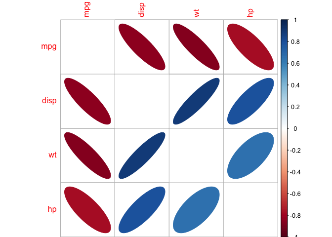

# Wizualizacja zależnosci
Maciej Beręsewicz  
11/23/2016  


## Wprowadzenie

Nauczymy się w jaki sposób poprawnie wizualizować zależności. O wizualizcji zależności mówimy w kontekście:

+ zmiennych ilościowych, którą możemy mierzyć wykorzystując:
    + Współczynnik korelacji liniowej Pearsona
    + Współczynnik korelacji rang Spearmana
    + Współczynnik korelacji Kendalla
+ zmiennych jakościowych, którą możemy mierzyć wykorzystując:
    + test $\chi^2$
    + współczynnik Yula'a $\phi$
    + współczynnik kontyngencji $C$ Pearsona
    + współczynnik zbieżności Czuprowa
    + współczynnik $V$ Cramera

Aby wyliczyć te wskaźniki można zastosować funkcję `cor` w przypadku danych ilościowych oraz `chisq.test` w przypadku zmiennych jakościowych. W drugim przypadku można również zastosować na funkcję `summary` na obiekcie klasy `table` lub `xtabs` albo skorzystać z pakietu `vcd` i funkcji `assocstats`.


Do dzisiejszych zajęć potrzebujemy następujących pakietów:


```r
library(vcd) ## współczynniki korelcji
library(corrplot) ## wizualizacja macierzy korelacji
library(ggcorrplot) ## wizualizacja macierzy korelacji z wykorzystaniem pakiety ggplot2
library(GGally) ## bardziej zaawansowana wizualizacja danych ciągłych
library(ca) ## dodatkowa analiza (mapa percepcji)
```


## Wizualizacja korelacji dla cech ciągłych

### Podstawowe funkcje R

W pierwszej kolejności wykorzystamy juz istniejące funkcje z podstawowego `R` czyli `plot` oraz `pairs`.

Skorzystamy ze zbioru `mtcars` dostępnego pakiecir `datasets`. Wybierzemy zmienne ciągłe.


```r
zmienne <- c('mpg','disp','wt','hp')

plot(mtcars[,zmienne])
graphics::pairs(mtcars[,zmienne])
```

<!-- -->

W funkcji `pairs` możemy wykorzystać kilka argumentów aby zmienic wykres, a dokładnie:

+ labels -- dodajemy etykiety na przekątnej
+ panel -- dodajemy trend aby sprawdzić czy jest liniowy
+ upper.panel -- możemy dodać współczynnik korelacji


```r
panel.cor <- function(x, y, digits = 2, prefix = "", cex.cor , ...)
{
    usr <- par("usr"); on.exit(par(usr))
    par(usr = c(0, 1, 0, 1))
    r <- abs(cor(x, y))
    txt <- format(c(r, 0.123456789), digits = digits)[1]
    txt <- paste0(prefix, txt)
    if (missing(cex.cor))
    {
    cex.cor <- 0.8 / strwidth(txt)
    }
      
    text(0.5, 0.5, txt, cex = cex.cor * r)
}

graphics::pairs(x = mtcars[,zmienne],
                labels = c('Miles/(US) gallon',
                           'Displacement (cu.in.)',
                           'Weight (1000 lbs)',
                           'Gross horsepower'),
                panel = panel.smooth,
                upper.panel = panel.cor)
```

<!-- -->


### Wybrane pakiety

### Pakiet `corrplot`


```r
korelacje <- cor(mtcars[,zmienne])

## domyślne ustawienia
corrplot(korelacje)
```

<!-- -->

```r
## trochę zmodyfikujemy
corrplot(corr = korelacje,
         method = 'ellipse',
         diag = FALSE)
```

<!-- -->

```r
## trochę zmodyfikujemy
corrplot(corr = korelacje,
         method = 'number',
         diag = FALSE)
```

<!-- -->

```r
## trochę zmodyfikujemy
corrplot(corr = korelacje,
         method = 'square',
         diag = FALSE)
```

<!-- -->


### Pakiet `ggcorrplot`


```r
korelacje <- cor(mtcars[,zmienne])

## domyślne ustawienia
ggcorrplot(korelacje)
```

<!-- -->

```r
## trochę zmodyfikujemy
ggcorrplot(corr = korelacje,
           method = 'circle',
           show.diag = TRUE,
           hc.order = TRUE,
           outline.color = 'white')
```

<!-- -->

### Pakiet `GGally`


```r
## domyślny wykres
ggpairs(mtcars[,zmienne])
```

<!-- -->


## Wizualizacja korelacji dla jakościowych

Wykorzystamy do tego celu funkcje z pakietu `vcd`.


```r
data(diagnoza, package = 'PogromcyDanych')
```

Sprawdzimy czy jest zależność między zadowoleniem z życia (`gp3`), a wykształceniem (`eduk4_2013`). W drugiej kolejności zobaczymy czy zadowolenie zależy różni się według województw (`wojewodztwo`). W tym celu zagregujemy dane w celu wykorzystania wag analitycznych i ograniczymy populację do osób w wieku pracującym


```r
## sprawdzamy rozkład ziennej gp3
table(diagnoza$gp3)
```

```
## 
##          WSPANIAŁE              UDANE        DOSYĆ DOBRE 
##               1033              10520               9074 
## ANI DOBRE, ANI ZŁE      NIEZBYT UDANE      NIESZCZĘŚLIWE 
##               4149               1257                196 
##            OKROPNE 
##                 77
```

```r
### łączymy poziomy
diagnoza$zycie <-
  ifelse(diagnoza$gp3 == 'OKROPNE',
  'NIESZCZĘŚLIWE',
  as.character(diagnoza$gp3))

dane_diag <- aggregate(waga_2013_osoby ~ zycie + eduk4_2013,
                       subset = wiek2013 %in% 15:67,
                       data = diagnoza,
                       FUN = function(x) round(sum(x)))

tabela1 <- xtabs(waga_2013_osoby ~eduk4_2013 + zycie,
                 dane_diag,
                 drop.unused.levels = TRUE)
summary(tabela1)
```

```
## Call: xtabs(formula = waga_2013_osoby ~ eduk4_2013 + zycie, data = dane_diag, 
##     drop.unused.levels = TRUE)
## Number of cases in table: 22426 
## Number of factors: 2 
## Test for independence of all factors:
## 	Chisq = 1077.6, df = 15, p-value = 3.022e-220
```

```r
colnames(tabela1) <- c('ani/ani','d.dobre','nieszcz','n.udane','udane','wspa')
rownames(tabela1)  <- c('podst i niz.','zasad/gim','średnie','wyzsz i in.')
assoc(tabela1, shade = TRUE)
```

<!-- -->


Wykonamy analize korespondencji aby zobaczyć, które odpowiedzi się grupują


```r
corresp <- ca(tabela1)
plot(corresp)
```

<!-- -->


