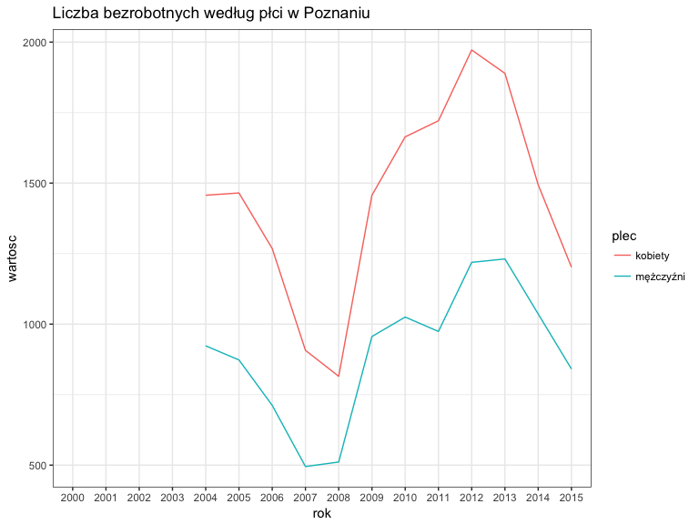

# Prezentacja WIRDS
Maciej Beręsewicz  
  


## Pierwszy slajd

testowy, **tekst pogrubiony**, *tekst napisany kursywą*, [tu jest link](http://www.stat.gov.pl) 

+ linia 1
+ linia 2
    + podpunkt jakiś
    + podpunkt jakiś 2
  
## Test czy plik jest widoczny


```
## # A tibble: 6 × 8
##          Kod                  Nazwa `Poziomy wykształcenia`   Płeć   Rok
##        <chr>                  <chr>                   <chr>  <chr> <chr>
## 1 1101506000 Powiat łódzki wschodni                  ogółem ogółem  2000
## 2 1101506000 Powiat łódzki wschodni                  ogółem ogółem  2001
## 3 1101506000 Powiat łódzki wschodni                  ogółem ogółem  2002
## 4 1101506000 Powiat łódzki wschodni                  ogółem ogółem  2003
## 5 1101506000 Powiat łódzki wschodni                  ogółem ogółem  2004
## 6 1101506000 Powiat łódzki wschodni                  ogółem ogółem  2005
## # ... with 3 more variables: Wartosc <chr>, `Jednostka miary` <chr>,
## #   Atrybut <dbl>
```

## Wykres bezrobocia rejestrowanego w Poznaniu





